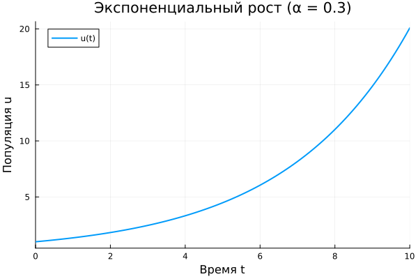
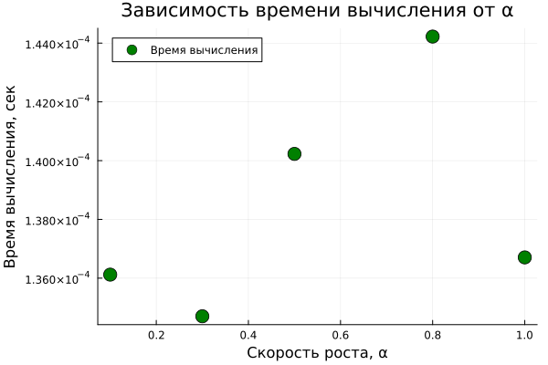

# Цель работы

## Цель и основные этапы

**Цель:** исследовать модель экспоненциального роста средствами Julia.

В работе:

- создан проект DrWatson;
- реализована и решена модель;
- проведено параметрическое исследование;
- результаты визуализированы и оформлены средствами Literate.jl и Quarto.

## Математическая модель

Экспоненциальный рост описывается уравнением

$$
\frac{du}{dt}=\alpha u.
$$

Его решение:

$$
u(t)=u_0e^{\alpha t}.
$$

$\alpha$ определяет скорость роста: чем больше $\alpha$, тем быстрее увеличивается $u(t)$.

## Базовый эксперимент

{width=68%}

$$
u_0=1,\qquad \alpha=0.3,\qquad t\in[0;10].
$$

**Результат:**  
$u(10)\approx20.09$, время удвоения $T_2\approx2.31$.

## Организация вычислений

Для выполнения работы использовались **Julia и DrWatson**.

- DifferentialEquations — решение ОДУ;
- Plots — построение графиков;
- Literate.jl — создание `.jl`, `.ipynb` и `.qmd`;
- Quarto — оформление отчёта и презентации.

Все результаты сохранялись внутри структуры проекта DrWatson.

## Параметрическое исследование

Исследованы значения

$$
\alpha=\{0.1,\;0.3,\;0.5,\;0.8,\;1.0\}.
$$

{width=78%}

Чем больше $\alpha$, тем быстрее растёт функция.

## Время удвоения

{width=72%}

$$
T_2=\frac{\ln2}{\alpha}.
$$

При увеличении $\alpha$ время удвоения уменьшается.

## Численные результаты

| $\alpha$ | $u(10)$ | $T_2$ |
|---:|---:|---:|
| 0.1 | 2.72 | 6.93 |
| 0.3 | 20.09 | 2.31 |
| 0.5 | 148.41 | 1.39 |
| 0.8 | 2980.96 | 0.87 |
| 1.0 | 22026.47 | 0.69 |

Рост результата с увеличением $\alpha$ имеет экспоненциальный характер.

## Бенчмаркинг

{width=67%}

Время численного решения для разных значений $\alpha$ отличается незначительно.

Различия также зависят от текущей нагрузки компьютера.

# Вывод

## Результаты работы

- реализована модель экспоненциального роста;
- выполнено численное и параметрическое исследование;
- подтверждена зависимость $T_2=\ln2/\alpha$;
- результаты автоматически сохранены и визуализированы.

**При увеличении $\alpha$ рост ускоряется, а время удвоения уменьшается.**
