# Цель работы

Целью лабораторной работы является подготовка рабочего пространства для курса, создание проекта DrWatson, установка необходимых пакетов Julia и выполнение примера модели экспоненциального роста. Также в работе требуется преобразовать код в литературный стиль, сгенерировать из него чистый код, Jupyter notebook и документацию Quarto, а затем выполнить параметрическое исследование модели.

# Задание

В лабораторной работе требуется:

1. Создать рабочий каталог для всего курса.
2. Создать рабочее пространство для программ в рамках лабораторной работы.
3. Выполнить все задания по тексту лабораторной работы.
4. Установить необходимые пакеты.
5. Выполнить предложенный код.
6. Преобразовать код в литературный стиль.
7. Сгенерировать из литературного кода чистый код, Jupyter notebook и документацию в формате Quarto.
8. Выполнить код из Jupyter notebook.
9. Интегрировать документацию в формате Quarto в отчёт.
10. Добавить вычисление для набора параметров.
11. Сгенерировать производные форматы для параметрического кода.
12. Выполнить параметрический код из Jupyter notebook.
13. Интегрировать документацию с параметрами в отчёт.

# Выполнение лабораторной работы

## Подготовка среды работы

Работу я выполняла в Windows с использованием WSL и Ubuntu. После запуска WSL я перешла в домашний каталог и проверила используемую операционную систему.

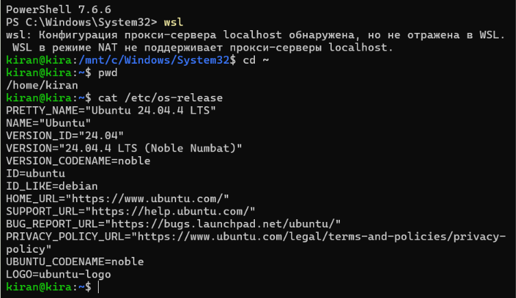{width=70%}

## Настройка Git

Для работы с репозиториями я настроила Git. В качестве имени пользователя было указано `Kira Nechaeva`, а для GitHub и GitVerse использовался общий адрес `knechaeva.git@gmail.com`.

Также были настроены SSH- и GPG-ключи и выполнена авторизация GitHub CLI.

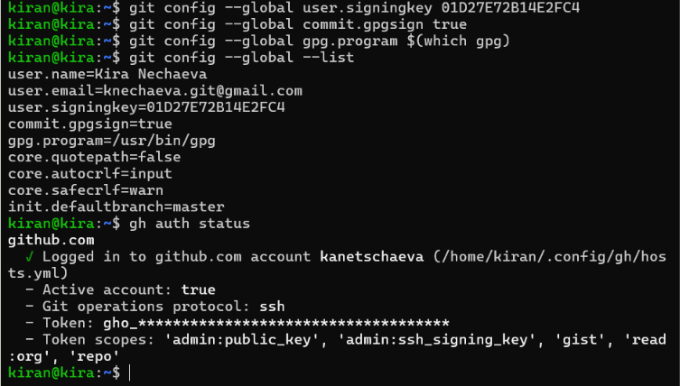{width=70%}

## Создание репозитория GitVerse

На основе шаблона курса в GitVerse был создан публичный репозиторий `2026-1--study--mathmod`.

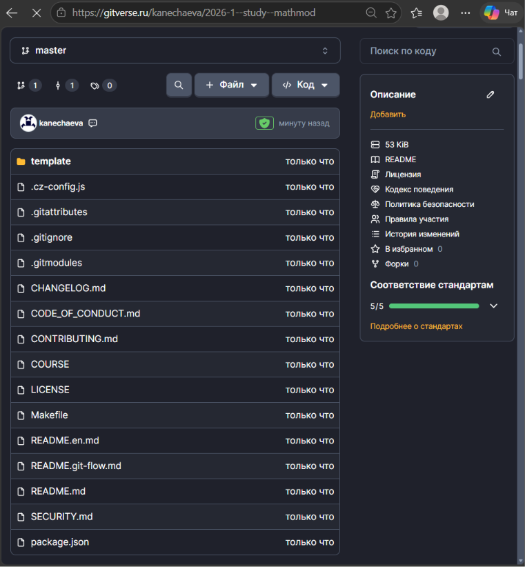{width=70%}

После этого был создан рабочий каталог курса и репозиторий был клонирован по SSH.

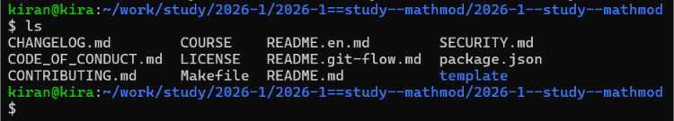{width=70%}

## Подготовка структуры курса

Для настройки курса был создан файл `COURSE`, содержащий значение `mathmod`, после чего была выполнена команда:

make prepare

Полученные изменения были добавлены в Git и отправлены в GitVerse.

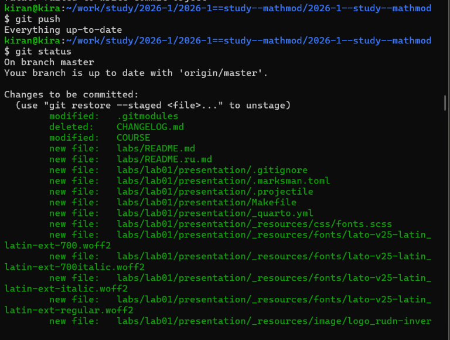{width=70%}

## Создание копии репозитория в GitHub

Дополнительно был создан публичный репозиторий `2026-1--study--mathmod` в GitHub.

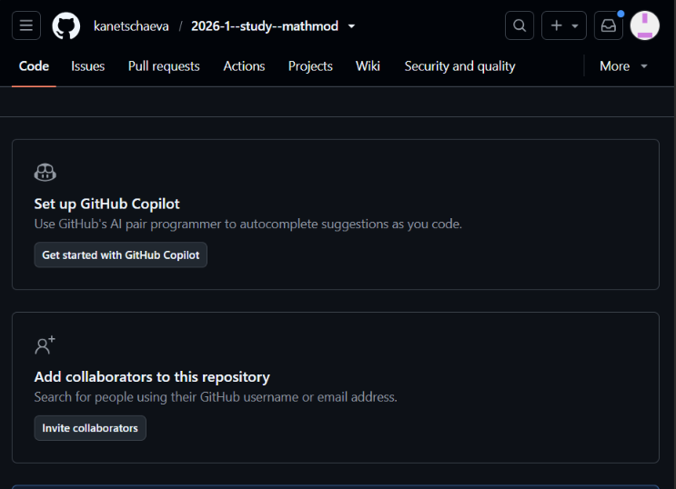{width=70%}

GitHub был добавлен как второй удалённый репозиторий с именем `github`, после чего ветка `master` была отправлена в него.

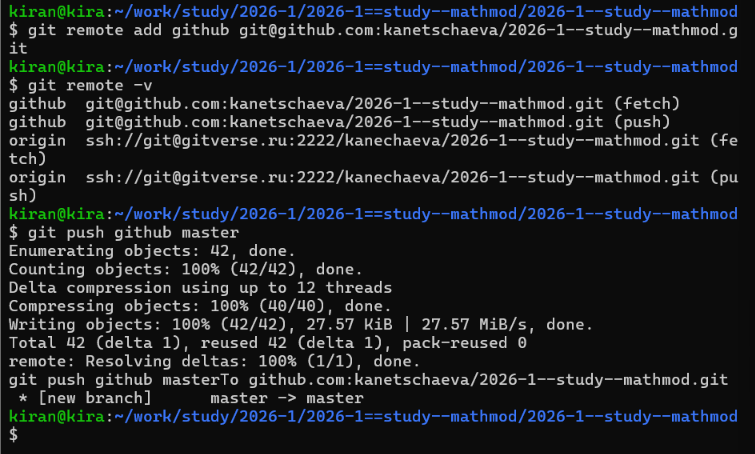{width=70%}

## Настройка Git Flow

Для организации разработки был инициализирован Git Flow. Основной веткой является `master`, веткой разработки - `develop`, а префиксом тегов выбран `v`.

После этого был создан первый релиз `1.0.0` и тег `v1.0.0`.

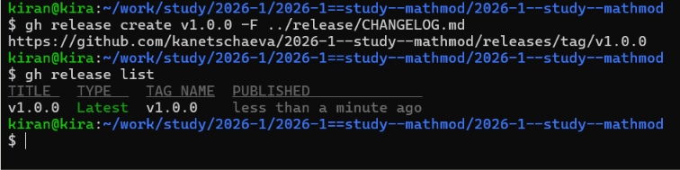{width=70%}

## Создание рабочего пространства лабораторной работы

В каталоге `labs` был создан каталог `lab01`. В нём находятся каталоги проекта, отчёта и презентации.

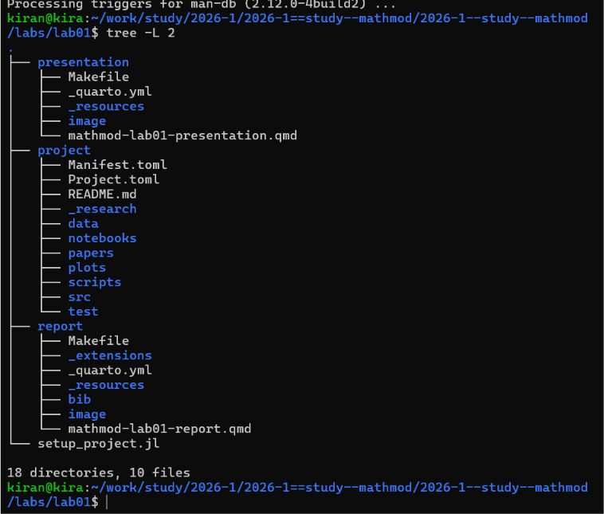{width=70%}

## Создание проекта DrWatson

В каталоге первой лабораторной работы был создан проект DrWatson с именем `project`.

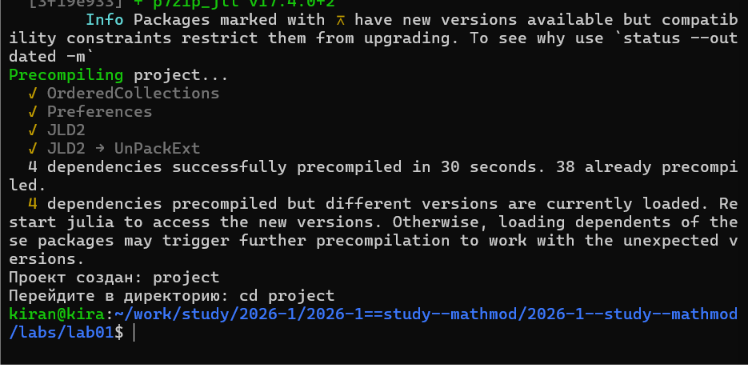{width=70%}

## Установка необходимых пакетов

В окружение проекта были установлены пакеты DrWatson, DifferentialEquations, Plots, DataFrames, CSV, JLD2, Literate, IJulia, BenchmarkTools и Quarto.

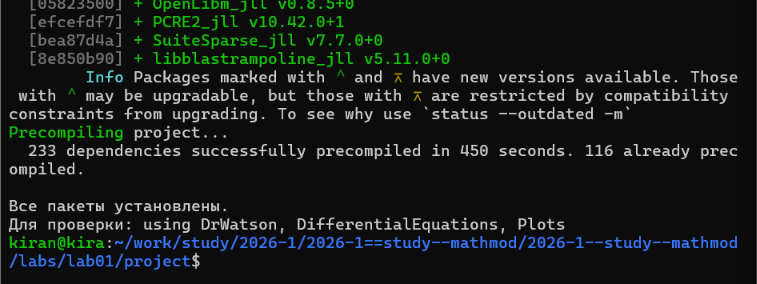{width=70%}

После установки была выполнена проверка загрузки основных пакетов.

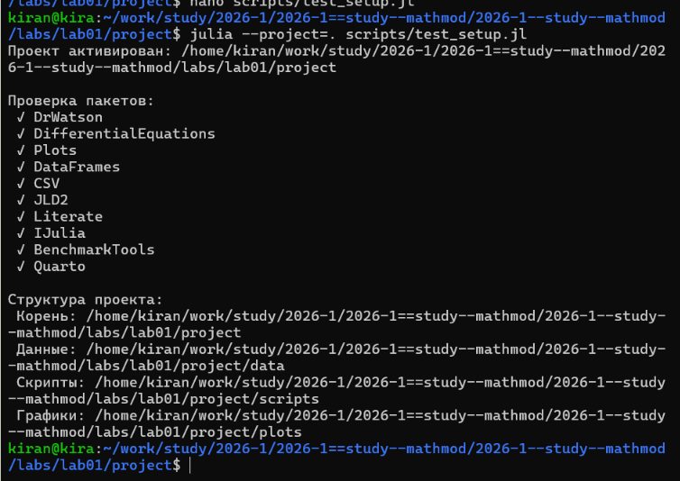{width=70%}

# Модель экспоненциального роста

Экспоненциальный рост описывается дифференциальным уравнением

$$
\frac{du}{dt} = \alpha u.
$$

Для первого эксперимента использовались начальное значение `u(0)=1`, коэффициент роста `α=0.3` и временной интервал от 0 до 10.

Для решения задачи использовался пакет DifferentialEquations и метод Tsit5.

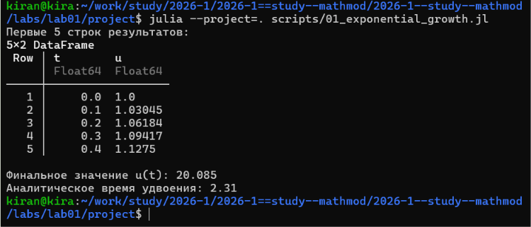{width=70%}

В результате был построен график изменения величины `u(t)`.

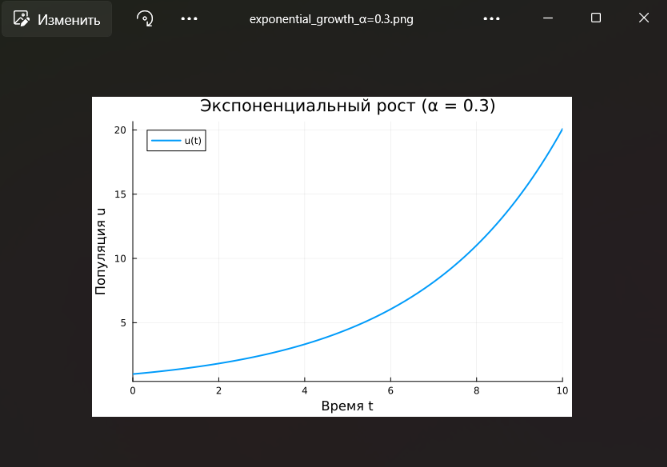{width=70%}

Время удвоения определяется по формуле

$$
t_2=\frac{\ln 2}{\alpha}.
$$

При `α=0.3` оно составляет примерно `2.31`.

## Преобразование программы в литературный стиль

После первого запуска программа была преобразована в литературный стиль. В код были добавлены поясняющие разделы, а результаты стали сохраняться в стандартные каталоги проекта DrWatson.

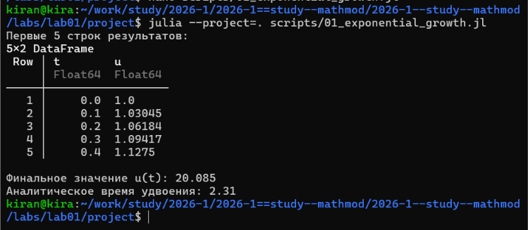{width=70%}

## Генерация производных форматов

При помощи Literate.jl из литературного исходного кода были сгенерированы:

- чистый Julia-код;
- документ Quarto;
- Jupyter notebook.

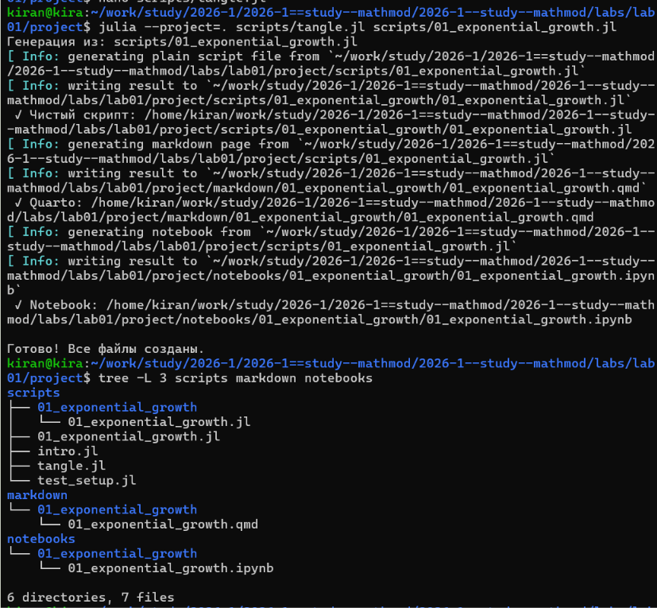{width=70%}

## Выполнение Jupyter notebook

Сгенерированный notebook `01_exponential_growth.ipynb` был открыт в Jupyter и выполнен.

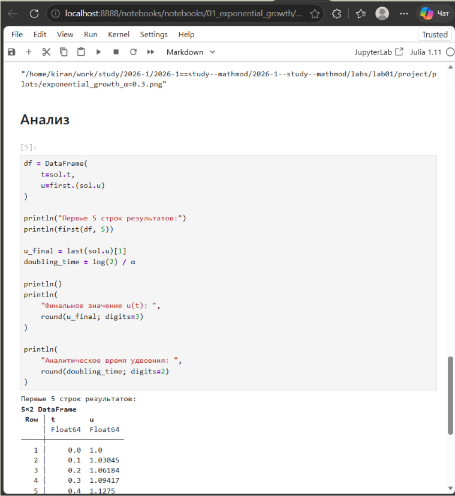{width=70%}

## Интеграция документации модели в отчёт

В отчёт была подключена документация, автоматически сгенерированная из литературного Julia-кода.



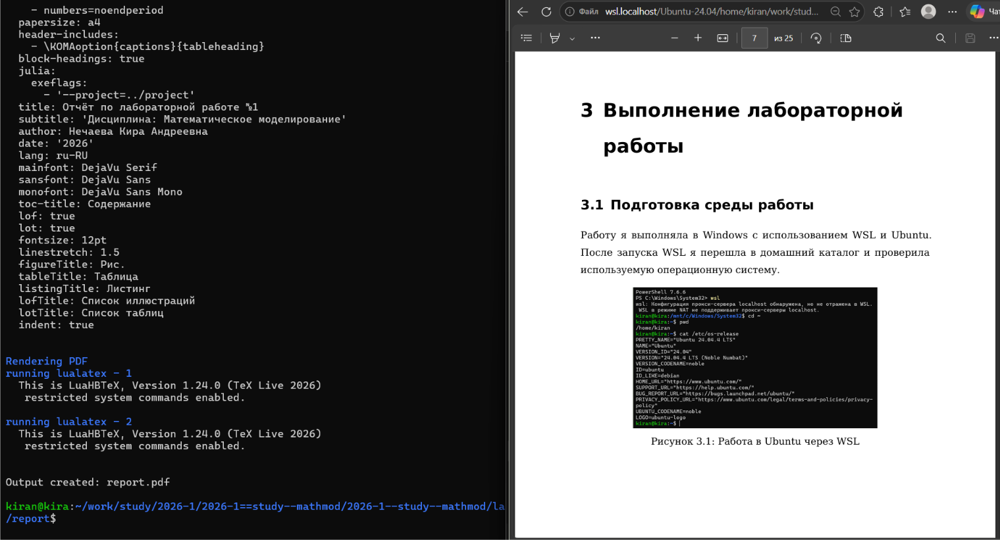{width=70%}

# Параметрическое исследование

После исследования базового случая модель была дополнена возможностью автоматического запуска для нескольких значений коэффициента роста.

Исследовались значения

α = 0.1, 0.3, 0.5, 0.8, 1.0.

Для каждого набора параметров программа решала задачу и сохраняла полученные результаты.

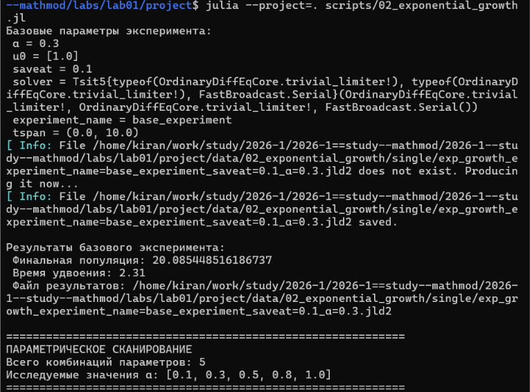{width=70%}

## Результаты параметрического исследования

Полученные результаты были собраны в общую таблицу.

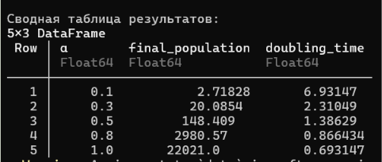{width=70%}

При увеличении коэффициента `α` значение функции в конце рассматриваемого интервала быстро увеличивается. Одновременно уменьшается время удвоения.

## Сравнение результатов

Для сравнения были построены траектории решения при всех исследованных значениях коэффициента роста.

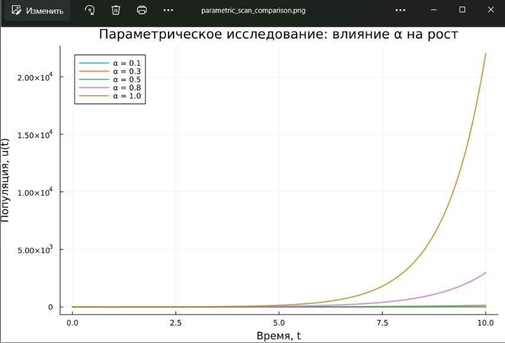{width=70%}

Также была построена зависимость времени удвоения от коэффициента роста.

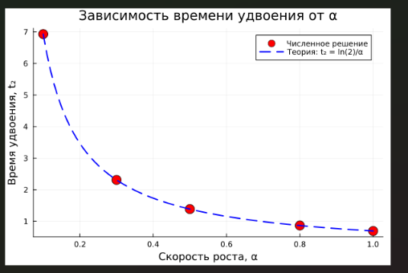{width=70%}

## Бенчмаркинг

Для оценки времени решения модели был выполнен бенчмаркинг для каждого исследуемого значения `α`.

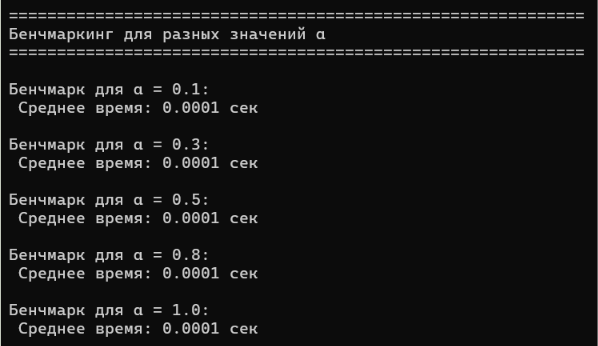{width=70%}

По полученным данным был построен график зависимости времени вычисления от значения параметра.

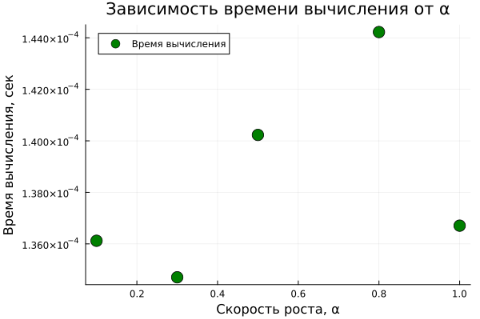{width=70%}

## Генерация форматов параметрического кода

Для параметрической версии программы также были сгенерированы чистый Julia-код, Quarto-документ и Jupyter notebook.

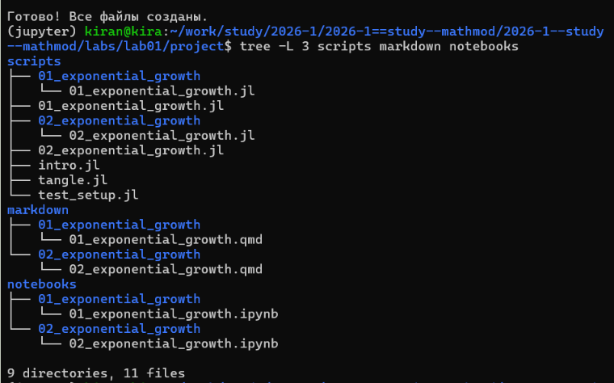{width=70%}

## Выполнение параметрического notebook

Сгенерированный notebook `02_exponential_growth.ipynb` был выполнен в Jupyter.

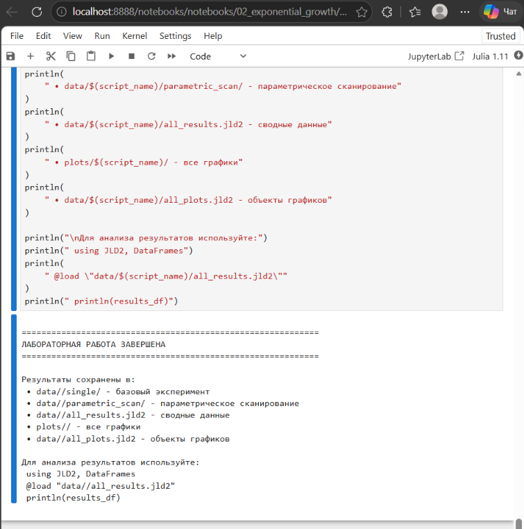{width=70%}

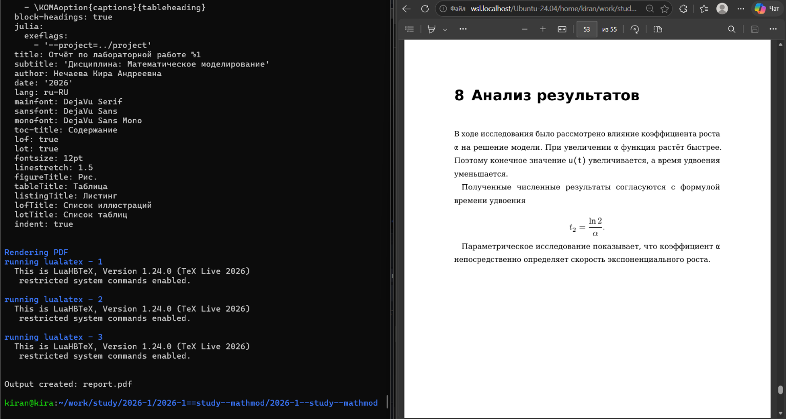{width=70%}## Интеграция документации параметрической модели

Документация параметрической версии модели также была автоматически сгенерирована из литературного кода и подключена к отчёту.



{width=70%}

# Анализ результатов

В ходе исследования было рассмотрено влияние коэффициента роста `α` на решение модели. При увеличении `α` функция растёт быстрее. Поэтому конечное значение `u(t)` увеличивается, а время удвоения уменьшается.

Полученные численные результаты согласуются с формулой времени удвоения

$$
t_2 = \frac{\ln 2}{\alpha}.
$$

Параметрическое исследование показывает, что коэффициент `α` непосредственно определяет скорость экспоненциального роста.

# Вывод

В ходе лабораторной работы было подготовлено рабочее пространство курса и создан проект DrWatson. Были установлены необходимые пакеты Julia и реализована модель экспоненциального роста.

Программа была преобразована в литературный стиль. Из литературного кода были автоматически сгенерированы чистый код, Jupyter notebook и документация Quarto.

Также было выполнено параметрическое исследование модели для нескольких значений коэффициента роста. Результаты показали, что увеличение `α` приводит к более быстрому росту функции и уменьшению времени удвоения.

Сгенерированная документация для обеих версий программы была интегрирована в отчёт.

# Список литературы{.unnumbered}

1. Методические материалы к лабораторной работе №1 по математическому моделированию.
