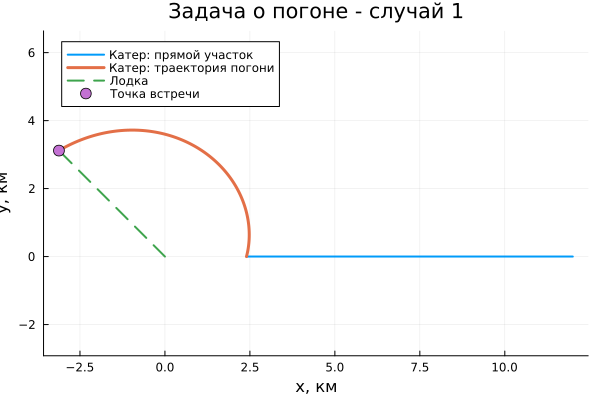

## Постановка задачи

**Вариант 2**

Начальное расстояние:

$$
k=12\text{ км}.
$$

Скорость катера в **4 раза больше** скорости лодки.

Необходимо:

- получить уравнение движения катера;
- рассмотреть два начальных положения;
- построить траектории;
- определить точки встречи.

## Математическая модель

Для первого случая:

$$
r_0=\frac{12}{4+1}=2.4\text{ км}.
$$

Для второго:

$$
r_0=\frac{12}{4-1}=4\text{ км}.
$$

Уравнение дальнейшего движения:

$$
\boxed{
\frac{dr}{d\theta}=\frac{r}{\sqrt{15}}
}
$$

Начальные условия:

$$
(\theta_0,r_0)=(0,2.4)
$$

$$
(\theta_0,r_0)=(-\pi,4)
$$

## Реализация

Модель реализована на **Julia**.

Для обоих случаев решается одно дифференциальное уравнение с разными начальными условиями.

Для построения траекторий полярные координаты преобразуются в декартовы:

$$
x=r\cos\theta,\qquad
y=r\sin\theta.
$$

Направление движения лодки:

$$
\varphi=\frac{3\pi}{4}.
$$

## Первый случай

{width=76%}

Начальный радиус:

$$
r_0=2.4\text{ км}.
$$

Точка встречи:

$$
\boxed{(-3.1182;\;3.1182)}
$$

## Второй случай

{width=76%}

Начальный радиус:

$$
r_0=4\text{ км}.
$$

Точка встречи:

$$
\boxed{(-11.6960;\;11.6960)}
$$

## Сравнение результатов

{width=90%}

В обоих случаях используется одно уравнение движения.

Различие траекторий определяется начальными условиями.

## Итог

Для варианта 2:

$$
k=12\text{ км}, \qquad n=4.
$$

Получено уравнение

$$
\frac{dr}{d\theta}=\frac{r}{\sqrt{15}}.
$$

Для двух начальных положений:

- построены траектории катера и лодки;
- определены точки их пересечения;
- получены разные траектории при одном уравнении движения.

