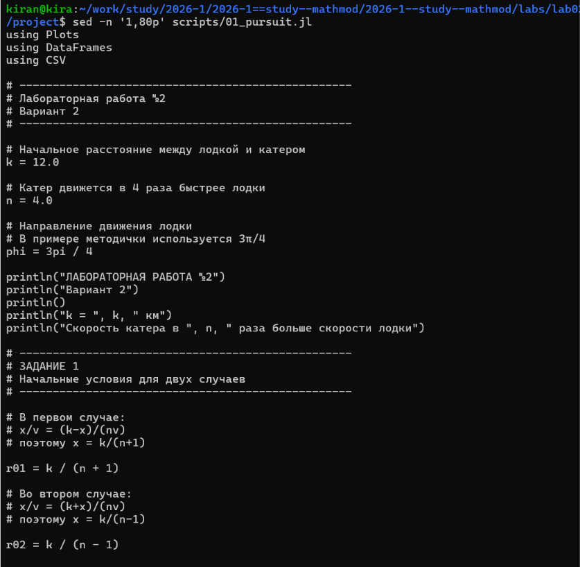
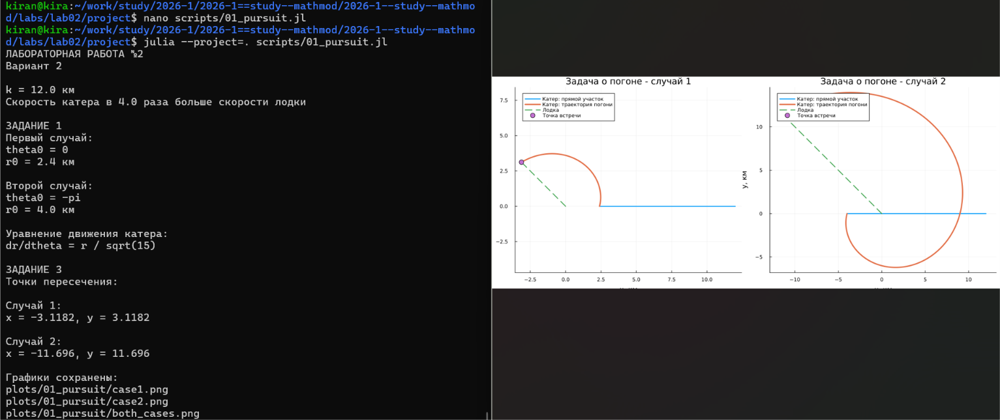
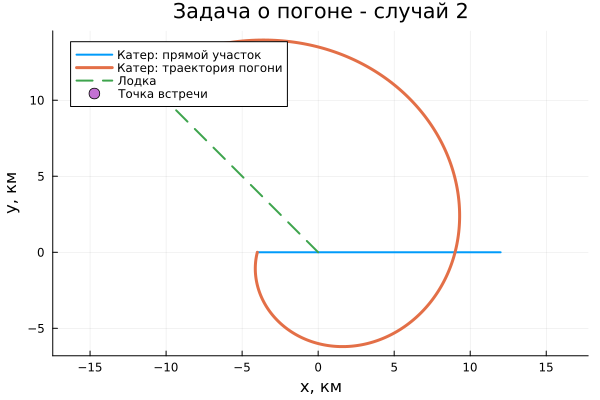
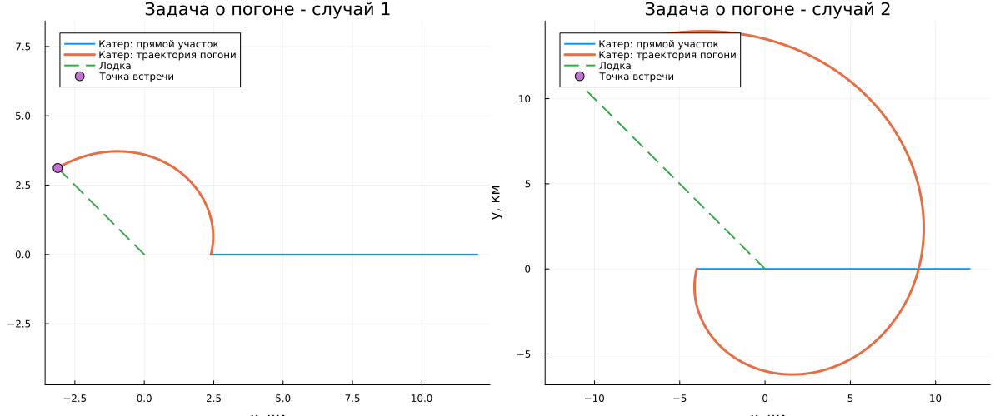

# Постановка задачи

В работе рассматривается задача о погоне катера береговой охраны за лодкой браконьеров.

Для варианта 2 начальное расстояние между лодкой и катером составляет

$$
k = 12 \text{ км}.
$$

Скорость катера в 4 раза больше скорости лодки:

$$
v_k = 4v.
$$

Необходимо:

1. записать уравнение движения катера с начальными условиями для двух случаев;
2. построить траектории катера и лодки для двух случаев;
3. определить точки пересечения траекторий.

# Математическая модель

До начала движения вокруг полюса катер должен оказаться на том же расстоянии от полюса, что и лодка.

Для первого случая:

$$
\frac{x}{v} = \frac{k-x}{4v}.
$$

Отсюда

$$
x_1 = \frac{k}{5} = 2.4 \text{ км}.
$$

Для второго случая:

$$
\frac{x}{v} = \frac{k+x}{4v}.
$$

Отсюда

$$
x_2 = \frac{k}{3} = 4 \text{ км}.
$$

После перехода к криволинейному движению скорость катера раскладывается на радиальную и тангенциальную составляющие.

Радиальная составляющая равна скорости лодки:

$$
\frac{dr}{dt} = v.
$$

Так как полная скорость катера равна $4v$, тангенциальная составляющая равна

$$
v_\tau = v\sqrt{15}.
$$

Следовательно,

$$
r\frac{d\theta}{dt}=v\sqrt{15}.
$$

После исключения времени получаем уравнение траектории катера:

$$
\boxed{
\frac{dr}{d\theta}=\frac{r}{\sqrt{15}}
}
$$

Начальные условия для первого случая:

$$
\theta_0=0,\qquad r_0=2.4.
$$

Начальные условия для второго случая:

$$
\theta_0=-\pi,\qquad r_0=4.
$$

# Реализация

Для численного решения была написана программа на Julia.

Параметры варианта задаются непосредственно в программе. Для двух случаев рассчитываются начальные радиусы, после чего создаются две задачи с одинаковым дифференциальным уравнением и разными начальными условиями.

{width=90%}

Для решения дифференциального уравнения используется численный метод Tsit5.

Направление движения лодки задаётся углом

$$
\varphi=\frac{3\pi}{4}.
$$

Это значение используется в примере из методических материалов.

# Результаты

После запуска программы были рассчитаны начальные условия и координаты точек пересечения траекторий.

{width=90%}

## Первый случай

В первом случае начальный радиус равен

$$
r_0=2.4\text{ км}.
$$

Полученная точка встречи:

$$
(x,y)\approx(-3.1182;\;3.1182).
$$

На рисунке показаны прямолинейный участок движения катера, дальнейшая траектория погони, движение лодки и точка встречи.

{width=80%}

## Второй случай

Во втором случае:

$$
r_0=4\text{ км},
\qquad
\theta_0=-\pi.
$$

Полученная точка встречи:

$$
(x,y)\approx(-11.6960;\;11.6960).
$$

{width=80%}

## Сравнение двух случаев

На следующем рисунке оба решения представлены рядом.

{width=100%}

В обоих случаях используется одно и то же дифференциальное уравнение движения катера. Различие траекторий связано с разными начальными условиями.

# Вывод

В ходе лабораторной работы была рассмотрена задача о погоне для второго варианта.

Для двух возможных начальных положений катера были получены начальные радиусы 2.4 км и 4 км. Движение катера после перехода к криволинейной траектории описывается уравнением

$$
\frac{dr}{d\theta}=\frac{r}{\sqrt{15}}.
$$

Для обоих случаев были построены траектории катера и лодки и определены точки их пересечения.

