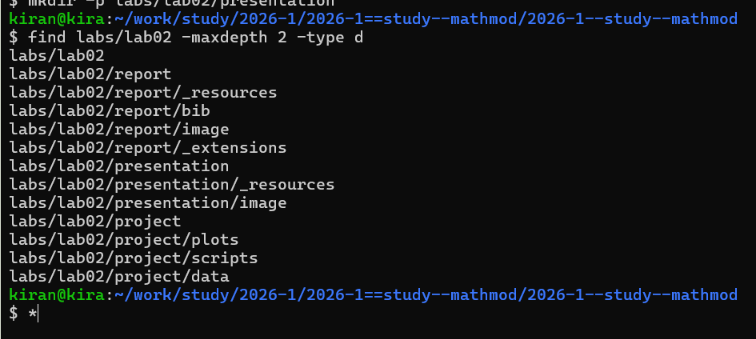
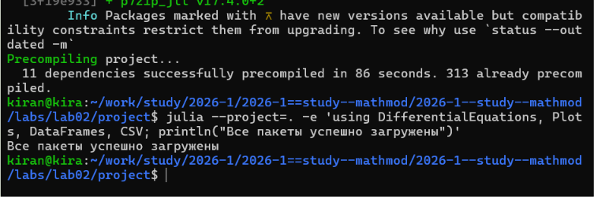
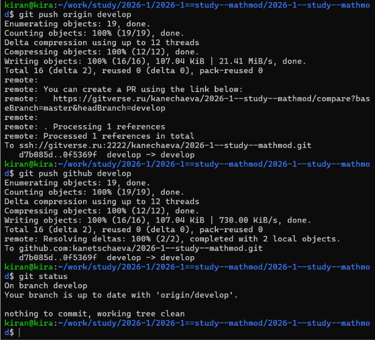

# Постановка задачи

В лабораторной работе рассматривается задача о погоне катера береговой охраны за лодкой браконьеров.

Для варианта 2 начальное расстояние между лодкой и катером составляет

$$
k = 12 \text{ км}.
$$

Скорость катера в 4 раза больше скорости лодки:

$$
v_k = 4v.
$$

Необходимо:

1. записать уравнение, описывающее движение катера, с начальными условиями для двух случаев;
2. построить траектории движения катера и лодки для двух случаев;
3. найти точки пересечения траекторий.

# Организация работы

Для лабораторной работы были созданы отдельные каталоги для программного кода, результатов вычислений, графиков, отчёта и презентации.

{width=90%}

Для реализации модели использовался язык Julia. Перед выполнением программы была проверена доступность необходимых пакетов для численного решения дифференциальных уравнений, построения графиков и обработки результатов.

{width=90%}

# Математическая модель

Сначала необходимо определить расстояние от полюса, на котором катер переходит от прямолинейного движения к движению вокруг полюса.

Для первого начального положения:

$$
\frac{x}{v}=\frac{k-x}{4v}.
$$

Отсюда

$$
4x=k-x,
$$

$$
5x=k,
$$

поэтому

$$
x_1=\frac{k}{5}=\frac{12}{5}=2.4\text{ км}.
$$

Для второго начального положения:

$$
\frac{x}{v}=\frac{k+x}{4v}.
$$

Отсюда

$$
4x=k+x,
$$

$$
3x=k,
$$

поэтому

$$
x_2=\frac{k}{3}=\frac{12}{3}=4\text{ км}.
$$

После перехода к криволинейному движению скорость катера раскладывается на радиальную и тангенциальную составляющие.

Радиальная скорость должна совпадать со скоростью лодки:

$$
\frac{dr}{dt}=v.
$$

Полная скорость катера равна $4v$. Поэтому тангенциальная составляющая определяется из соотношения

$$
v_\tau=
\sqrt{(4v)^2-v^2}
=
v\sqrt{15}.
$$

При этом

$$
v_\tau=r\frac{d\theta}{dt}.
$$

Следовательно,

$$
r\frac{d\theta}{dt}=v\sqrt{15}.
$$

После исключения времени получаем дифференциальное уравнение движения катера:

$$
\boxed{
\frac{dr}{d\theta}=\frac{r}{\sqrt{15}}
}
$$

Для первого случая используются начальные условия

$$
\theta_0=0,\qquad r_0=2.4.
$$

Для второго случая:

$$
\theta_0=-\pi,\qquad r_0=4.
$$

# Программная реализация

Модель была реализована на языке Julia.

В программе сначала задаются параметры варианта:

$$
k=12,\qquad n=4.
$$

Затем вычисляются начальные радиусы для двух случаев и задаётся дифференциальное уравнение движения катера.

{width=90%}

Для обоих случаев решается одно дифференциальное уравнение, но используются разные начальные условия.

Направление движения лодки задаётся углом

$$
\varphi=\frac{3\pi}{4},
$$

который используется в программном примере методических материалов.

Для построения траекторий полученные полярные координаты переводятся в декартовы:

$$
x=r\cos\theta,
$$

$$
y=r\sin\theta.
$$

# Результаты вычислений

После запуска программы были получены начальные условия и координаты точек встречи для двух случаев.

{width=90%}

## Первый случай

Для первого случая:

$$
\theta_0=0,\qquad r_0=2.4\text{ км}.
$$

Полученная точка встречи имеет координаты приблизительно

$$
\boxed{
(x,y)=(-3.1182;\;3.1182)
}
$$

На графике показаны начальный прямолинейный участок движения катера, дальнейшая траектория погони, прямолинейное движение лодки и точка их встречи.

{width=80%}

## Второй случай

Для второго случая:

$$
\theta_0=-\pi,\qquad r_0=4\text{ км}.
$$

Полученная точка встречи:

$$
\boxed{
(x,y)=(-11.6960;\;11.6960)
}
$$

{width=80%}

## Сравнение двух случаев

На следующем рисунке результаты для двух начальных положений катера представлены рядом.

{width=100%}

В обоих случаях движение после перехода к криволинейной траектории описывается одним уравнением

$$
\frac{dr}{d\theta}=\frac{r}{\sqrt{15}}.
$$

При этом разные начальные условия приводят к различным траекториям и различным точкам встречи с лодкой.

# Сохранение результатов

После завершения вычислений файлы лабораторной работы были добавлены в репозиторий. Изменения были зафиксированы коммитом и отправлены в удалённые репозитории.

{width=90%}

# Вывод

В ходе лабораторной работы была рассмотрена задача о погоне для варианта 2, в котором начальное расстояние между катером и лодкой составляет 12 км, а скорость катера в 4 раза превышает скорость лодки. :chatgpt-content-reference{index="1"}

Для двух возможных начальных положений катера были получены начальные радиусы

$$
r_{01}=2.4\text{ км},
\qquad
r_{02}=4\text{ км}.
$$

Получено дифференциальное уравнение движения катера

$$
\frac{dr}{d\theta}=\frac{r}{\sqrt{15}}.
$$

Для обоих наборов начальных условий задача была решена численно. Построены траектории движения катера и лодки и определены точки их пересечения.

Результаты показывают, что при одном и том же уравнении движения изменение начальных условий приводит к различным траекториям и различным точкам встречи.