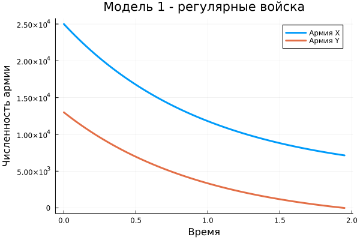

## Постановка задачи

**Вариант 2**

Начальные численности:

$$
x(0)=25000,
\qquad
y(0)=13000.
$$

Рассматриваются два случая:

- боевые действия между регулярными войсками;
- регулярные войска и партизанские отряды.

Цель — построить зависимости $x(t)$ и $y(t)$ и определить результат противостояния.

## Модель 1. Регулярные войска

$$
\frac{dx}{dt}
=
-0.41x-0.83y+\sin(t+3),
$$

$$
\frac{dy}{dt}
=
-0.29x-0.63y+\cos(t+3).
$$

Система является линейной относительно численностей $x$ и $y$.

Моделирование прекращается, когда численность одной из сторон достигает нуля.

## Результат первой модели

{width=78%}

Армия $Y$ первой достигает нулевой численности.

**Победитель: армия X.**

## Модель 2. Регулярные войска и партизаны

$$
\frac{dx}{dt}
=
-0.33x-0.88y+\sin(t),
$$

$$
\frac{dy}{dt}
=
-0.44xy-0.77y+\cos(3t).
$$

Главное отличие:

$$
\boxed{-0.44xy}
$$

Потери зависят одновременно от численности обеих сторон.

## Результат второй модели

{width=78%}

Динамика развивается значительно быстрее, чем в первой модели.

Армия $Y$ снова первой достигает нулевой численности.

**Победитель: армия X.**

## Сравнение моделей

{width=90%}

В обеих моделях:

- начальные условия одинаковы;
- победителем является армия $X$.

При этом характер изменения численностей различается из-за структуры уравнений.

## Основное различие

**Модель 1**

Потери задаются линейными членами:

$$
x,\qquad y.
$$

**Модель 2**

Появляется нелинейное взаимодействие:

$$
xy.
$$

Поэтому скорость изменения численности может сильно зависеть от текущего состояния обеих сторон.

## Итог

Для варианта 2 были реализованы две системы дифференциальных уравнений.

Для каждой модели:

- выполнено численное решение;
- построены графики $x(t)$ и $y(t)$;
- определена проигравшая сторона.

В обоих случаях первой нулевой численности достигает армия $Y$.

**Победитель — армия X.**
