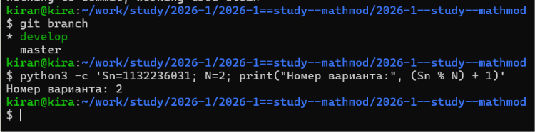
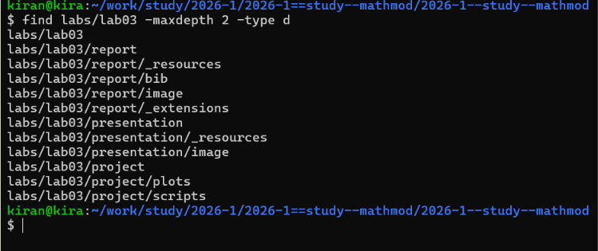
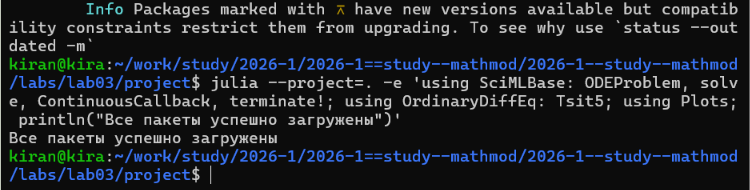
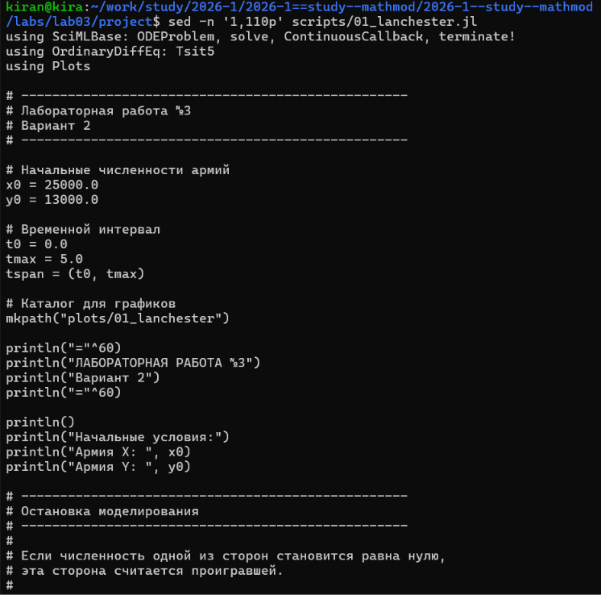
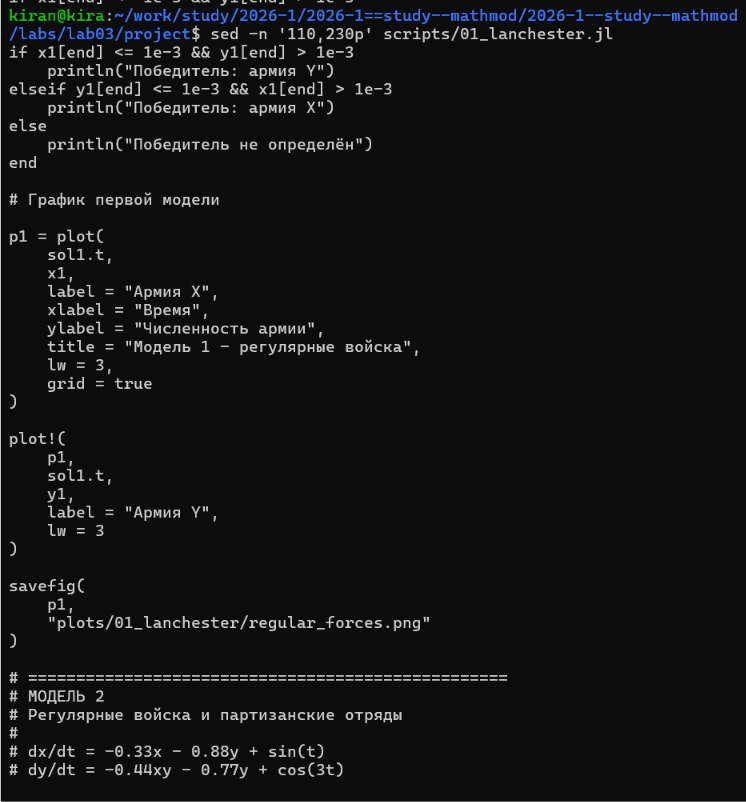
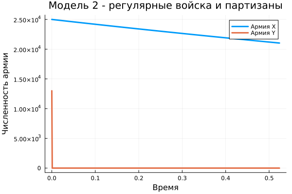
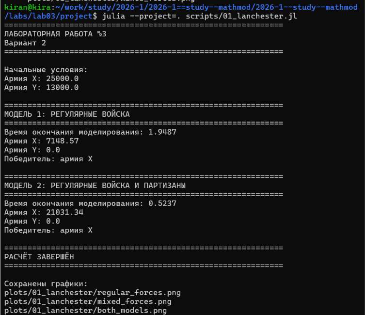
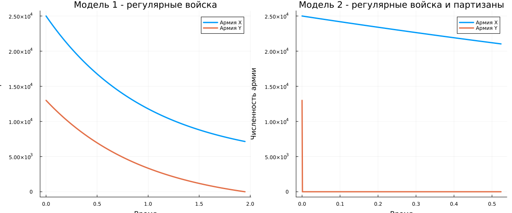
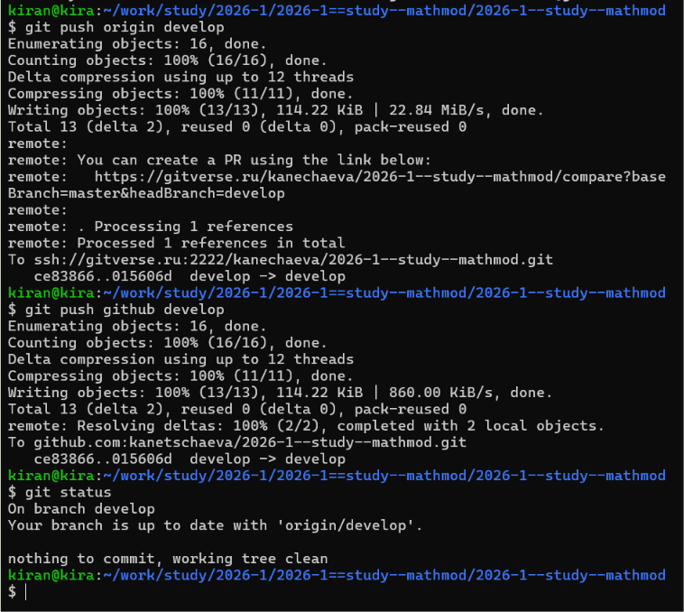

# Определение варианта

Номер варианта определялся по формуле

$$
(S_n \bmod N)+1,
$$

где $S_n=1132236031$ — номер студенческого билета, а $N=2$.

В результате получен вариант 2.

{width=90%}

# Постановка задачи

В работе рассматриваются модели боевых действий между двумя сторонами $X$ и $Y$.

Для варианта 2 начальные численности составляют

$$
x(0)=25000,
$$

$$
y(0)=13000.
$$

Необходимо построить графики изменения численности войск для двух случаев:

1. боевые действия между регулярными войсками;
2. боевые действия с участием регулярных войск и партизанских отрядов.

# Организация работы

Для лабораторной работы была создана отдельная структура каталогов для программы, графиков, отчёта и презентации.

{width=90%}

Для численного решения систем дифференциальных уравнений использовались пакеты SciMLBase и OrdinaryDiffEq, а для построения графиков — Plots.

Перед запуском программы была выполнена проверка необходимых пакетов.

{width=90%}

# Модель 1. Регулярные войска

Для первого случая система имеет вид

$$
\frac{dx}{dt}
=
-0.41x-0.83y+\sin(t+3),
$$

$$
\frac{dy}{dt}
=
-0.29x-0.63y+\cos(t+3).
$$

Начальные условия:

$$
x(0)=25000,\qquad y(0)=13000.
$$

Члены, содержащие $x$ и $y$, описывают уменьшение численности сторон вследствие различных потерь, а функции синуса и косинуса задают поступление подкрепления.

Модель была реализована в Julia в виде системы обыкновенных дифференциальных уравнений.

{width=95%}

В программе также используется условие остановки моделирования. Если численность одной из сторон достигает нуля, эта сторона считается проигравшей.

## Результат первой модели

Численное решение показывает изменение численности обеих армий во времени.

{width=82%}

В ходе моделирования численность обеих сторон уменьшается. Армия $Y$ первой достигает нулевой численности, поэтому в рамках данной модели победителем является армия $X$.

# Модель 2. Регулярные войска и партизанские отряды

Во втором случае используется система

$$
\frac{dx}{dt}
=
-0.33x-0.88y+\sin(t),
$$

$$
\frac{dy}{dt}
=
-0.44xy-0.77y+\cos(3t).
$$

Главное отличие второй модели состоит в наличии произведения $xy$ во втором уравнении.

В этом случае величина потерь зависит одновременно от численности обеих сторон, что соответствует особенностям модели с участием партизанских отрядов.

{width=95%}

## Результат второй модели

Для второй системы также было выполнено численное решение с теми же начальными условиями.

{width=82%}

В этой модели изменение численности происходит значительно быстрее. Армия $Y$ также первой достигает нулевой численности.

# Результаты выполнения программы

После запуска программы в терминал выводятся результаты моделирования для обоих случаев: время окончания расчёта, итоговые численности и победитель.

{width=92%}

Для обоих рассматриваемых случаев по результатам численного моделирования победителем является армия $X$.

# Сравнение моделей

На следующем рисунке графики двух моделей представлены рядом.

{width=100%}

В первой модели изменение численностей определяется линейной системой дифференциальных уравнений.

Во второй модели присутствует нелинейный член $xy$. Из-за этого характер и скорость изменения численности сторон отличаются от первой модели.

# Сохранение результатов

После завершения работы файлы лабораторной были добавлены в Git и отправлены в удалённые репозитории.

{width=90%}

# Вывод

В ходе лабораторной работы были реализованы две модели боевых действий для второго варианта.

Начальная численность армии $X$ составила 25000 человек, армии $Y$ — 13000 человек.

В первом случае рассматривалось взаимодействие двух регулярных армий. Во втором случае моделировались боевые действия с участием регулярных войск и партизанских отрядов.

Для обеих систем было выполнено численное решение и построены графики изменения численности сторон.

В обоих рассмотренных случаях армия $Y$ первой достигает нулевой численности, поэтому в рамках заданных моделей победителем является армия $X$.

При этом вторая модель отличается от первой наличием нелинейного члена $xy$, поэтому динамика численности сторон существенно отличается.
