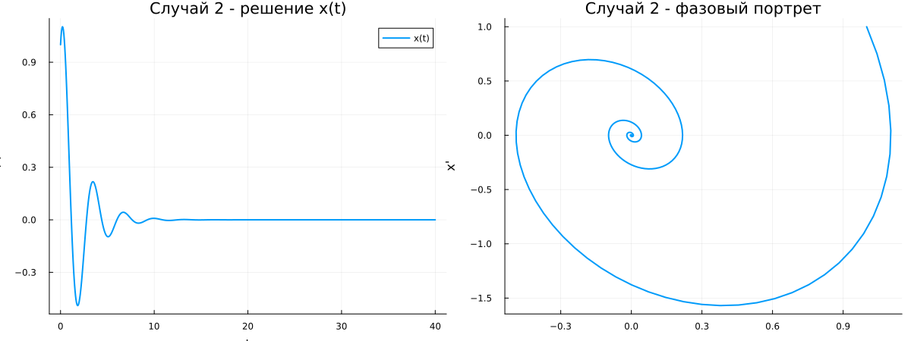

## Постановка задачи

**Вариант 2**

Начальные условия:

$$
x(0)=1,\qquad x'(0)=1.
$$

Интервал:

$$
t\in[0;40],\qquad \Delta t=0.05.
$$

Исследуются три режима:

- без затухания;
- с затуханием;
- с затуханием и внешней силой.

## Численное решение

Уравнение второго порядка представляется системой:

$$
x'=y,
$$

$$
y'=f(t,x,y).
$$

После этого система численно решается в Julia.

Для каждого случая строятся:

- решение $x(t)$;
- фазовый портрет $(x,x')$.

## Случай 1. Без затухания

$$
x''+3x=0
$$

или

$$
x'=y,\qquad y'=-3x.
$$

{width=88%}

Амплитуда колебаний сохраняется.

Фазовая траектория замкнута.

## Случай 2. С затуханием

$$
x''+x'+4x=0
$$

или

$$
x'=y,\qquad y'=-y-4x.
$$

{width=88%}

Амплитуда со временем уменьшается.

## Что меняется при затухании

В системе появляется член, зависящий от скорости:

$$
-y.
$$

Он описывает потери энергии.

Поэтому:

- колебания постепенно ослабевают;
- решение стремится к нулю;
- фазовая траектория приближается к началу координат.

## Случай 3. Внешняя сила

$$
x''+2x'+x=\sin(2t)
$$

или

$$
x'=y,
$$

$$
y'=\sin(2t)-2y-x.
$$

{width=88%}

## Роль внешней силы

Внешнее воздействие

$$
\sin(2t)
$$

периодически передаёт системе энергию.

Поэтому, несмотря на затухание, колебания не исчезают полностью.

После переходного процесса движение поддерживается внешней силой.

## Сравнение

**Без затухания**

Амплитуда сохраняется.

**С затуханием**

Амплитуда уменьшается.

**С внешней силой**

Колебания продолжаются за счёт внешнего воздействия.

Фазовые портреты наглядно показывают различие поведения системы.

## Итог

Для варианта 2 исследованы три режима гармонического осциллятора.

Для каждого случая:

- уравнение второго порядка преобразовано в систему первого порядка;
- выполнено численное решение;
- построена зависимость $x(t)$;
- построен фазовый портрет.

Характер движения определяется наличием затухания и внешней силы.
