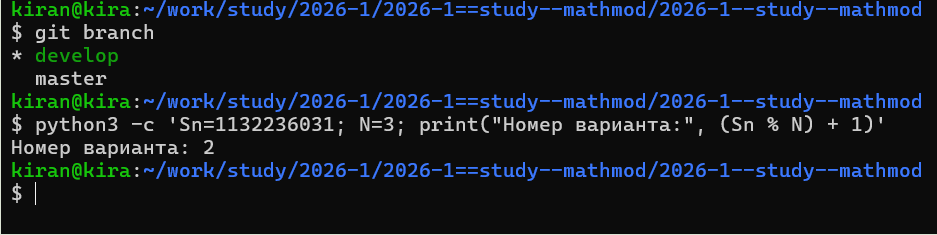
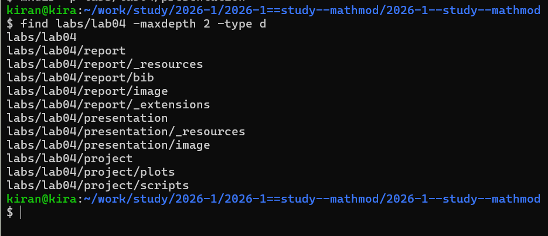
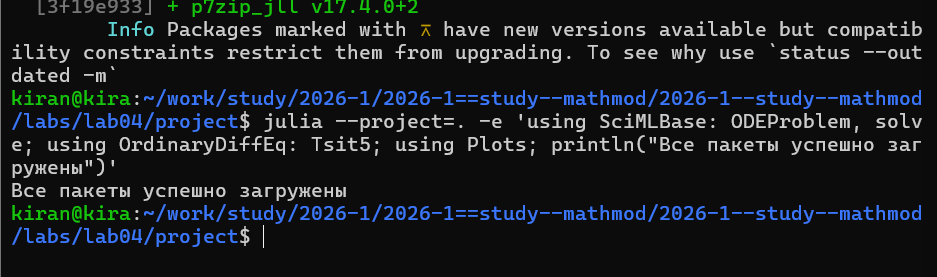
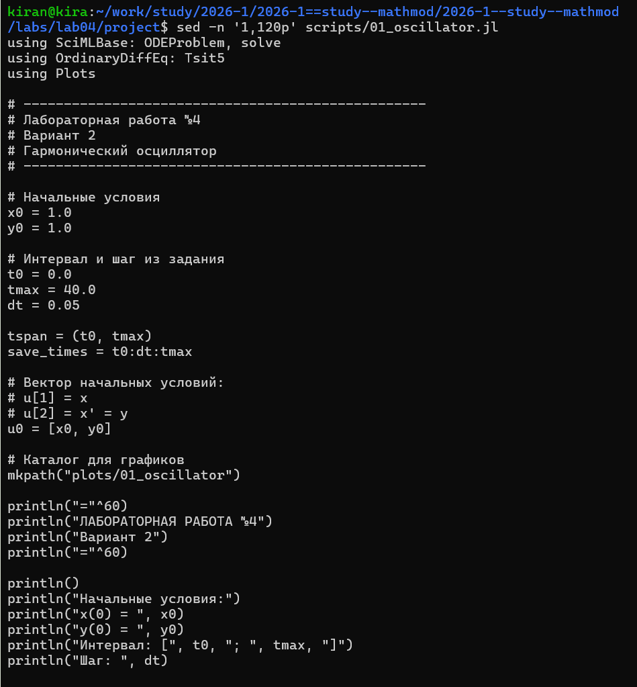
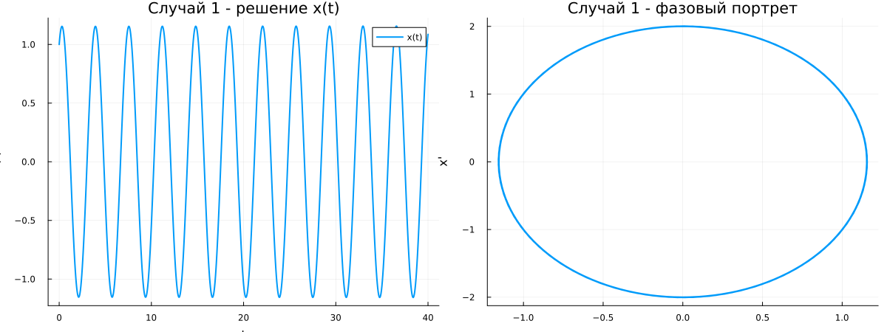
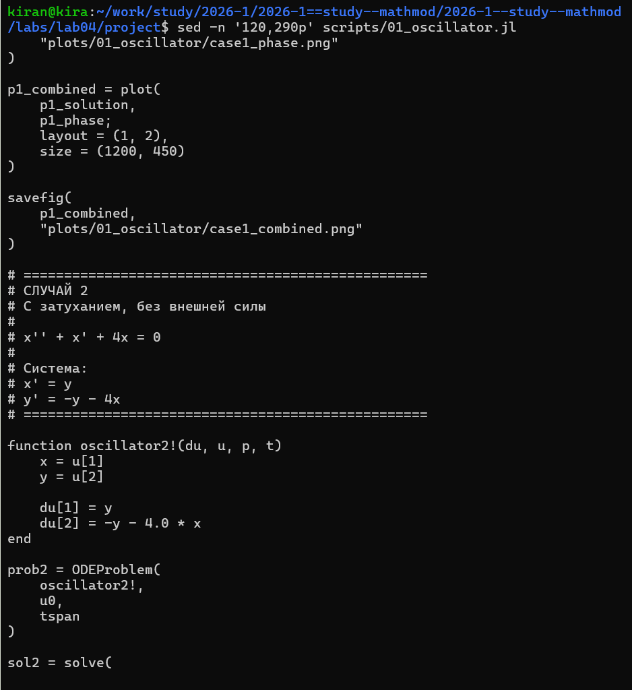
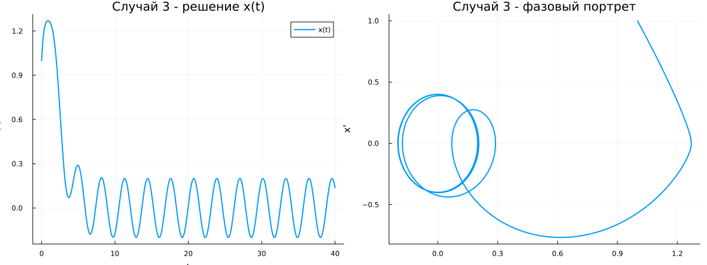
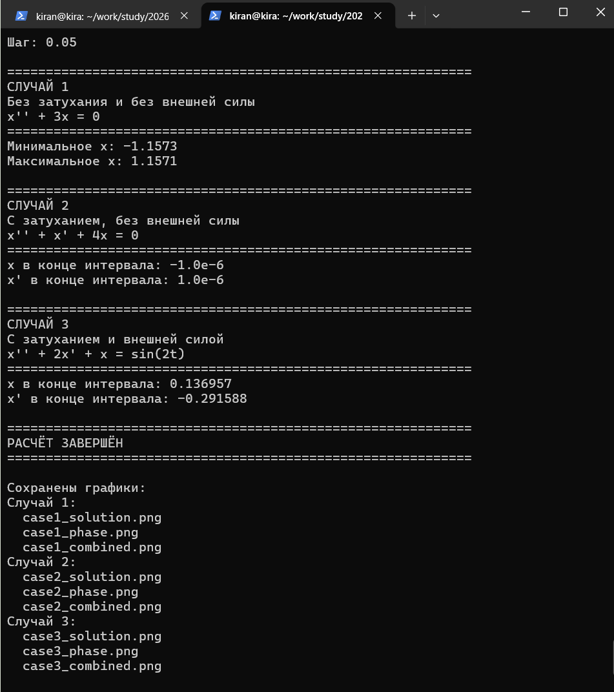
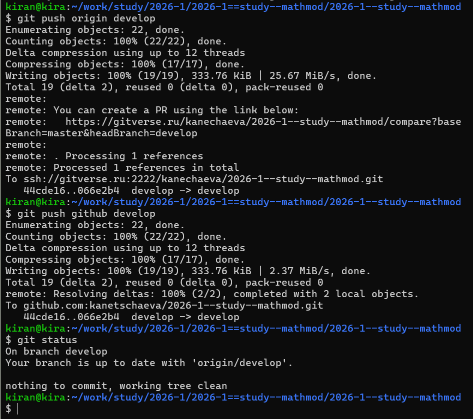

# Определение варианта

Номер варианта определялся по формуле

$$
(S_n \bmod N)+1.
$$

Для номера студенческого билета 1132236031 был получен вариант 2.

{width=90%}

# Постановка задачи

Для варианта 2 необходимо исследовать гармонический осциллятор в трёх случаях:

1. без затухания и без действия внешней силы;
2. с затуханием и без действия внешней силы;
3. с затуханием и под действием внешней силы.

Используются начальные условия

$$
x(0)=1,\qquad y(0)=1,
$$

интервал

$$
t\in[0;40]
$$

и шаг

$$
\Delta t=0.05.
$$

# Организация работы

Для лабораторной работы была создана отдельная структура каталогов для программы, графиков, отчёта и презентации.

{width=90%}

Для численного решения использовались пакеты SciMLBase и OrdinaryDiffEq, для построения графиков — Plots.

{width=90%}

# Переход к системе первого порядка

Исходные модели задаются дифференциальными уравнениями второго порядка.

В программе вводится новая переменная

$$
y=x',
$$

поэтому каждое уравнение второго порядка представляется как система двух уравнений первого порядка:

$$
x'=y,
$$

$$
y'=f(t,x,y).
$$

Такой вид используется для численного решения системы.

# Случай 1. Колебания без затухания

Для первого случая задано уравнение

$$
x''+3x=0.
$$

В программе оно представлено системой

$$
x'=y,
$$

$$
y'=-3x.
$$

Фрагмент реализации первого случая:

{width=95%}

После численного решения были построены зависимость координаты от времени и фазовый портрет.

{width=100%}

Так как затухание отсутствует, амплитуда колебаний не уменьшается. Фазовая траектория является замкнутой.

# Случай 2. Колебания с затуханием

Для второго случая:

$$
x''+x'+4x=0.
$$

Система первого порядка имеет вид

$$
x'=y,
$$

$$
y'=-y-4x.
$$

Здесь член, содержащий скорость $y$, отвечает за затухание колебаний.

# Случай 3. Колебания с внешней силой

Для третьего случая:

$$
x''+2x'+x=\sin(2t).
$$

После перехода к системе:

$$
x'=y,
$$

$$
y'=\sin(2t)-2y-x.
$$

В правой части появляется периодическая внешняя сила $\sin(2t)$.

Реализация второго и третьего случаев представлена на следующем скриншоте.

{width=95%}

## Результат второго случая

{width=100%}

При наличии затухания амплитуда постепенно уменьшается. На фазовой плоскости траектория приближается к началу координат.

## Результат третьего случая

{width=100%}

В третьем случае одновременно присутствуют затухание и периодическая внешняя сила. После переходного процесса внешнее воздействие продолжает поддерживать колебания системы.

# Результаты выполнения программы

Программа последовательно решает три системы на одном временном интервале и сохраняет отдельные графики для каждого случая.

{width=92%}

Для каждого режима были получены:

- зависимость $x(t)$;
- фазовый портрет;
- объединённый рисунок с обоими графиками.

# Сравнение режимов

Первый случай соответствует незатухающим свободным колебаниям.

Во втором случае присутствуют потери энергии, поэтому амплитуда уменьшается.

В третьем случае затухание компенсируется действием периодической внешней силы, поэтому движение системы сохраняется.

Фазовый портрет позволяет увидеть различия между тремя режимами не только во времени, но и на плоскости состояния $(x,x')$.

# Сохранение результатов

После завершения лабораторной работы изменения были добавлены в Git и отправлены в удалённые репозитории.

{width=90%}

# Вывод

В ходе лабораторной работы были исследованы три режима гармонического осциллятора для второго варианта.

Исходные дифференциальные уравнения второго порядка были представлены в виде систем двух уравнений первого порядка и решены численно средствами Julia.

Для каждого случая были построены решение $x(t)$ и фазовый портрет.

В модели без затухания амплитуда сохраняется. При наличии затухания колебания постепенно прекращаются. При действии внешней периодической силы колебания поддерживаются внешним воздействием.

Полученные графики позволяют наглядно сравнить поведение системы в трёх режимах.
