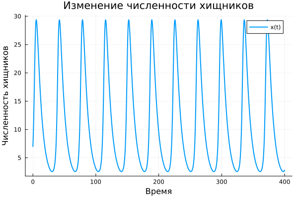
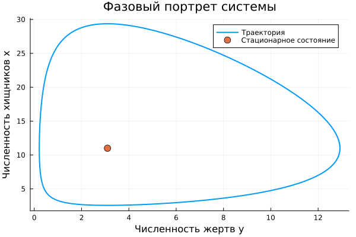
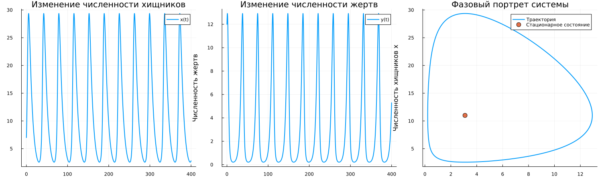

## Постановка задачи

**Вариант 2**

Модель описывает взаимодействие двух популяций:

- $x(t)$ — хищники;
- $y(t)$ — жертвы.

Начальные условия:

$$
x(0)=7,
\qquad
y(0)=12.
$$

Необходимо построить временные зависимости, фазовый портрет и найти стационарное состояние.

## Модель Лотки–Вольтерры

$$
\frac{dx}{dt}
=
-0.13x+0.042xy,
$$

$$
\frac{dy}{dt}
=
0.33y-0.03xy.
$$

Члены $xy$ связывают динамику двух популяций.

Изменение одной популяции влияет на дальнейшее изменение другой.

## Стационарное состояние

Стационарное состояние соответствует

$$
\frac{dx}{dt}=0,
\qquad
\frac{dy}{dt}=0.
$$

Для варианта 2:

$$
\boxed{x^*=11}
$$

$$
\boxed{y^*\approx3.0952}
$$

В этой точке численности обеих популяций остаются постоянными.

## Хищники во времени

{width=82%}

Численность хищников периодически увеличивается и уменьшается.

## Жертвы во времени

{width=82%}

Численность жертв также изменяется периодически.

Колебания двух популяций связаны между собой.

## Фазовый портрет

{width=82%}

Точкой отмечено стационарное состояние.

Траектория проходит вокруг положения равновесия.

## Почему возникают колебания

При большом количестве жертв хищникам достаточно пищи, поэтому их численность увеличивается.

Рост числа хищников усиливает сокращение популяции жертв.

После уменьшения количества жертв хищникам становится недостаточно пищи, и их численность тоже начинает уменьшаться.

После этого популяция жертв снова восстанавливается.

## Общий результат

{width=92%}

Модель показывает взаимосвязанные периодические колебания двух популяций.

Начальное состояние определяет конкретную фазовую траекторию.

## Итог

Для варианта 2:

- реализована модель Лотки–Вольтерры;
- выполнено численное решение;
- построены $x(t)$ и $y(t)$;
- построен фазовый портрет;
- найдено стационарное состояние.

$$
\boxed{(x^*,y^*)\approx(11;\;3.0952)}
$$
