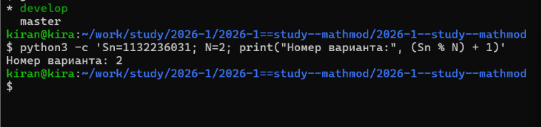
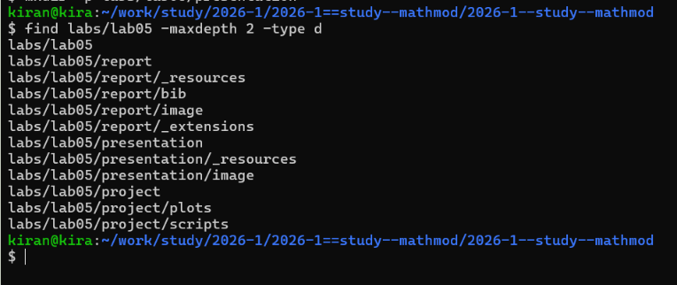
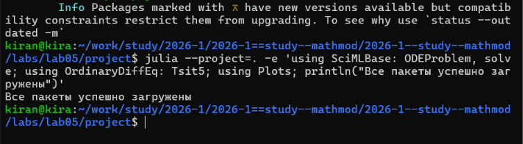
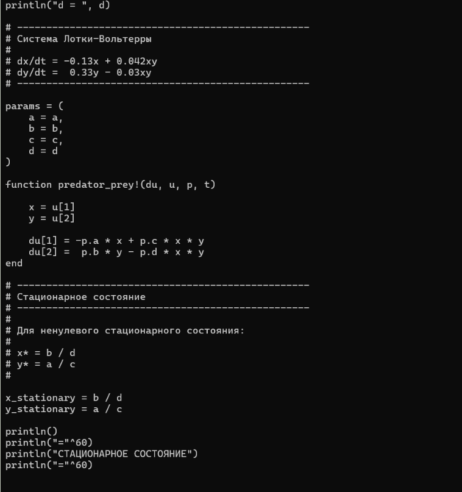
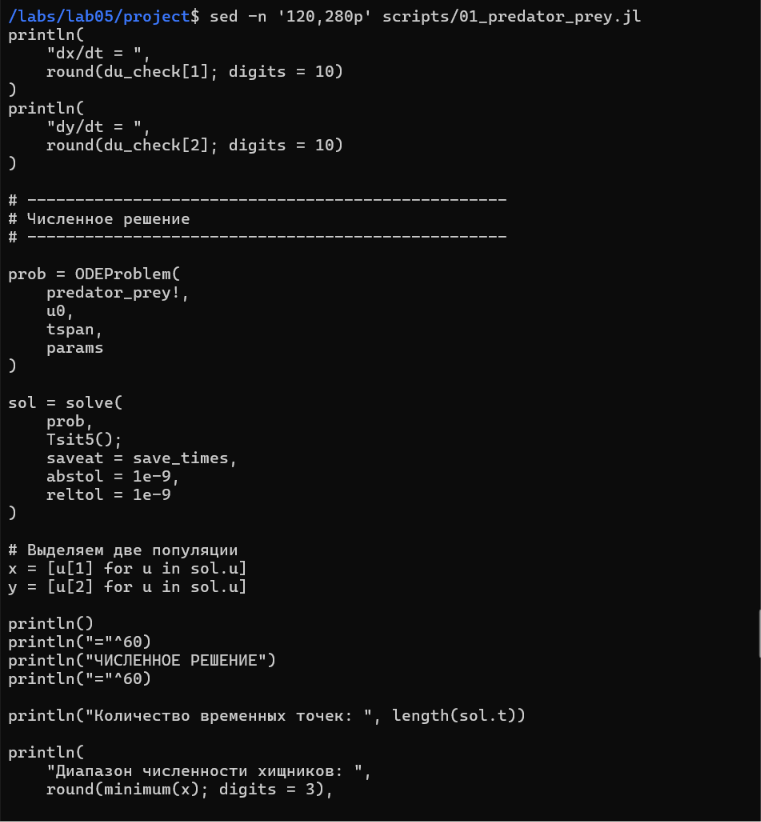
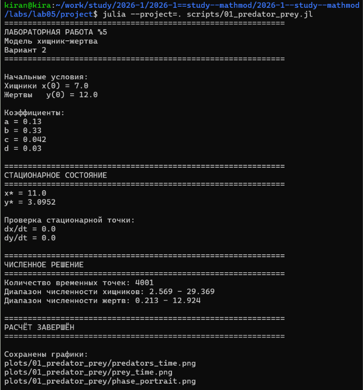
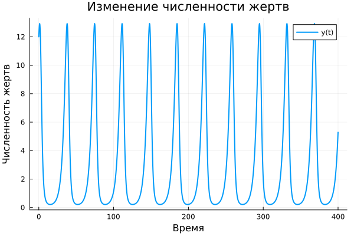
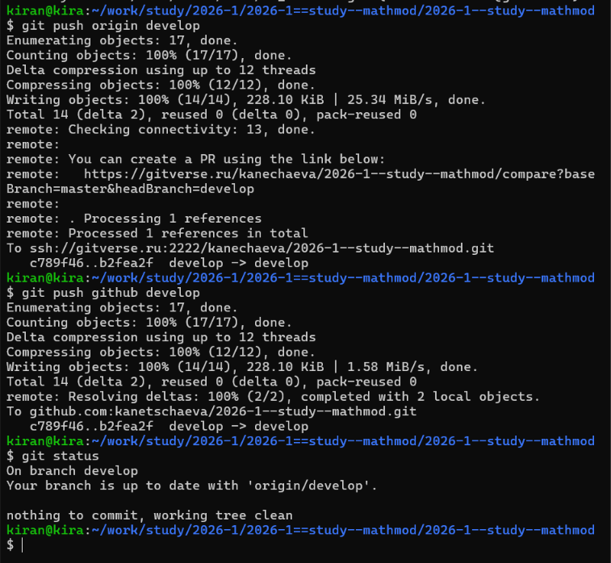

# Определение варианта

Номер варианта определялся по формуле

$$
(S_n \bmod N)+1.
$$

Для номера студенческого билета 1132236031 был получен вариант 2.

{width=90%}

# Постановка задачи

Рассматривается модель взаимодействия двух популяций типа «хищник-жертва».

В используемой реализации:

- $x(t)$ — численность хищников;
- $y(t)$ — численность жертв.

Для варианта 2 система имеет вид

$$
\frac{dx}{dt}
=
-0.13x+0.042xy,
$$

$$
\frac{dy}{dt}
=
0.33y-0.03xy.
$$

Начальные условия:

$$
x(0)=7,
\qquad
y(0)=12.
$$

Необходимо:

1. построить график изменения численности хищников;
2. построить график изменения численности жертв;
3. построить зависимость численности хищников от численности жертв;
4. найти стационарное состояние системы.

# Организация работы

Для лабораторной работы была создана отдельная структура каталогов для программного кода, графиков, отчёта и презентации.

{width=90%}

Для численного решения системы использовались пакеты SciMLBase и OrdinaryDiffEq, а для построения графиков — Plots.

{width=90%}

# Программная реализация модели

Коэффициенты системы и начальные численности задаются непосредственно в программе.

Система реализована в виде функции, возвращающей две производные:

$$
\frac{dx}{dt}
=
-0.13x+0.042xy,
$$

$$
\frac{dy}{dt}
=
0.33y-0.03xy.
$$

Член $xy$ описывает взаимодействие двух популяций. Изменение численности одной популяции зависит от текущей численности другой.

{width=95%}

# Стационарное состояние

Стационарным называется состояние, при котором обе производные равны нулю и численности популяций не изменяются.

Для ненулевого стационарного состояния программа получает:

$$
x^*=11,
$$

$$
y^*\approx3.0952.
$$

После вычисления найденная точка подставляется обратно в систему. Получается:

$$
\frac{dx}{dt}=0,
\qquad
\frac{dy}{dt}=0.
$$

Таким образом, найденные значения действительно соответствуют стационарному состоянию.

# Численное решение и построение графиков

После задания системы создаётся задача Коши и выполняется её численное решение.

Из полученного решения отдельно выделяются значения $x(t)$ и $y(t)$.

Затем программа строит:

- изменение численности хищников во времени;
- изменение численности жертв во времени;
- фазовый портрет системы.

{width=95%}

# Результаты выполнения программы

После запуска программа выводит параметры задачи, стационарное состояние, результаты его проверки и информацию о численном решении.

{width=92%}

Проверка показывает, что в стационарной точке обе производные равны нулю.

# Изменение численности хищников

На следующем графике показано изменение численности хищников во времени.

{width=82%}

Численность популяции периодически увеличивается и уменьшается.

# Изменение численности жертв

{width=82%}

Изменение численности жертв также имеет колебательный характер.

Колебания двух популяций связаны: увеличение или уменьшение одной популяции влияет на дальнейшее изменение другой.

# Фазовый портрет

Фазовый портрет показывает зависимость численности хищников от численности жертв.

{width=82%}

Стационарное состояние отмечено отдельной точкой.

При начальных условиях, отличных от стационарных, система движется по замкнутой траектории вокруг положения равновесия.

# Общий результат

На следующем рисунке все три зависимости представлены одновременно.

{width=100%}

Графики показывают периодический характер изменения обеих популяций и их взаимосвязь.

# Сохранение результатов

После завершения моделирования файлы лабораторной работы были добавлены в Git и отправлены в удалённые репозитории.

{width=90%}

# Вывод

В ходе лабораторной работы была реализована модель Лотки–Вольтерры «хищник-жертва» для второго варианта.

При начальных условиях

$$
x(0)=7,
\qquad
y(0)=12
$$

было выполнено численное решение системы дифференциальных уравнений.

Построены графики изменения численности хищников и жертв и фазовый портрет системы.

Найдено ненулевое стационарное состояние

$$
(x^*,y^*)\approx(11;\;3.0952).
$$

При начальных значениях, отличных от стационарных, численности популяций совершают периодические колебания вокруг положения равновесия.
