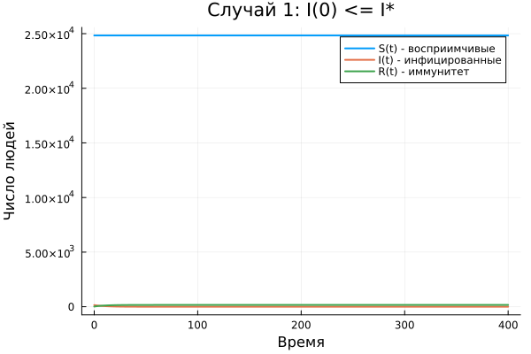
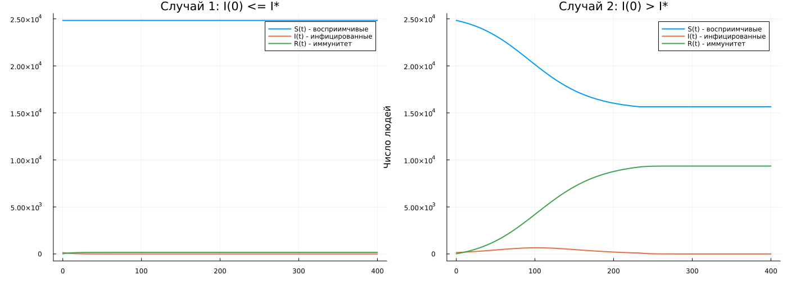

## Постановка задачи

**Вариант 2**

Общая численность населения:

$$
N=25000.
$$

Начальные значения:

$$
S(0)=24835,
\qquad
I(0)=150,
\qquad
R(0)=15.
$$

Необходимо сравнить два сценария:

$$
I(0)\le I^*
\qquad \text{и} \qquad
I(0)>I^*.
$$

## Три группы населения

**$S(t)$** — восприимчивые к инфекции.

**$I(t)$** — инфицированные и распространяющие инфекцию.

**$R(t)$** — выздоровевшие с иммунитетом.

Общая численность населения сохраняется:

$$
S(t)+I(t)+R(t)=N.
$$

## Логика модели

:::: {.columns}

::: {.column width="50%"}

### Если $I(t)>I^*$

Инфекция распространяется:

$$
\frac{dS}{dt}=-\alpha SI,
$$

$$
\frac{dI}{dt}=\alpha SI-\beta I.
$$

:::

::: {.column width="50%"}

### Если $I(t)\le I^*$

Новых заражений нет:

$$
\frac{dS}{dt}=0,
$$

$$
\frac{dI}{dt}=-\beta I.
$$

:::

::::

В обоих случаях выздоровевшие переходят в группу $R$:

$$
\frac{dR}{dt}=\beta I.
$$

## Первый случай: изоляция

:::: {.columns align=center}

::: {.column width="32%"}

$$
I(0)=150
$$

$$
I^*=200
$$

Следовательно,

$$
\boxed{I(0)\le I^*}
$$

Новых заражений нет.

:::

::: {.column width="68%"}

{width=100%}

:::

::::

## Первый случай: результат

При режиме изоляции:

- число восприимчивых практически не меняется;
- инфицированные постепенно выздоравливают;
- количество людей с иммунитетом увеличивается.

$$
I(t)\rightarrow0.
$$

**Эпидемическая вспышка не развивается.**

## Второй случай: распространение

:::: {.columns align=center}

::: {.column width="32%"}

$$
I(0)=150
$$

$$
I^*=100
$$

Следовательно,

$$
\boxed{I(0)>I^*}
$$

Инфекция начинает распространяться.

:::

::: {.column width="68%"}

{width=100%}

:::

::::

## Второй случай: результат

При превышении критического уровня:

- $S(t)$ уменьшается;
- $I(t)$ сначала увеличивается;
- после достижения максимума $I(t)$ уменьшается;
- $R(t)$ увеличивается.

**Возникает эпидемическая вспышка.**

## Сравнение сценариев

{width=78%}

Начальные значения населения одинаковы.

$$
I\le I^*
\quad\Rightarrow\quad
\text{режим изоляции},
$$

$$
I>I^*
\quad\Rightarrow\quad
\text{распространение инфекции}.
$$

## Итог

Для варианта 2 реализована модель эпидемии с тремя группами населения:

$$
S(t),\qquad I(t),\qquad R(t).
$$

Рассмотрены оба режима:

- $I(0)\le I^*$ — новых заражений нет;
- $I(0)>I^*$ — инфекция распространяется.

Для каждого случая выполнено численное решение и построена динамика всех трёх групп.

**Критический уровень $I^*$ определяет режим развития эпидемии.**
