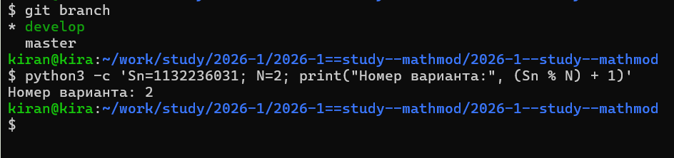
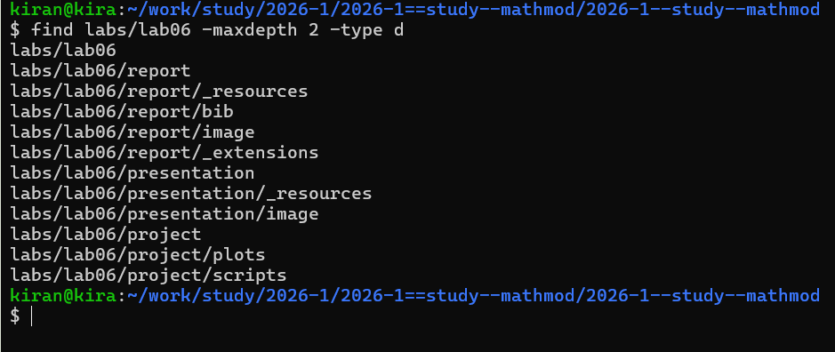
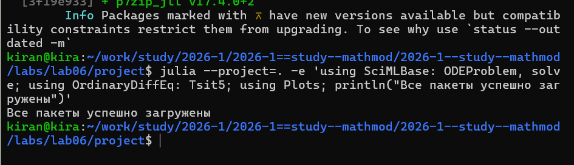
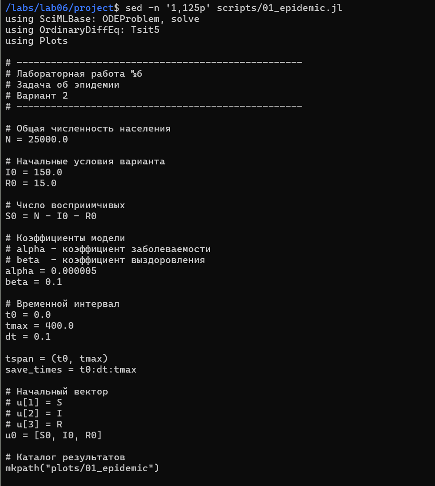
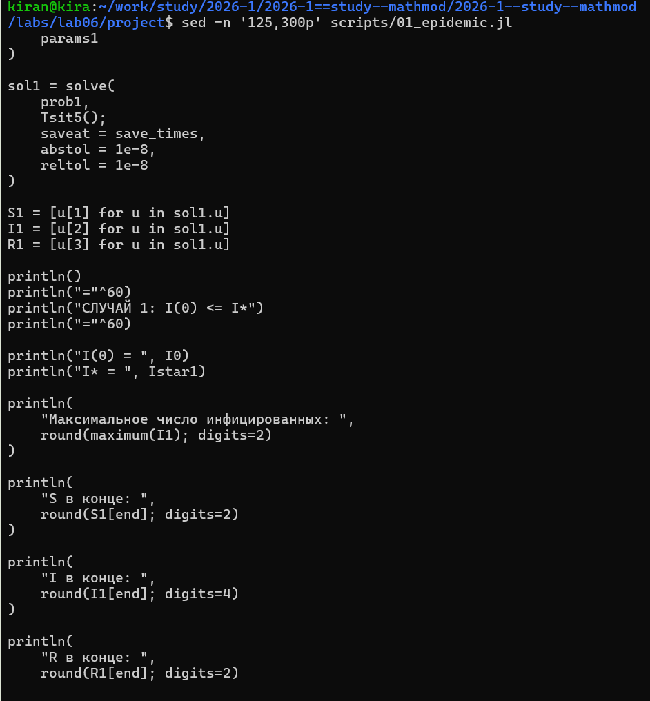
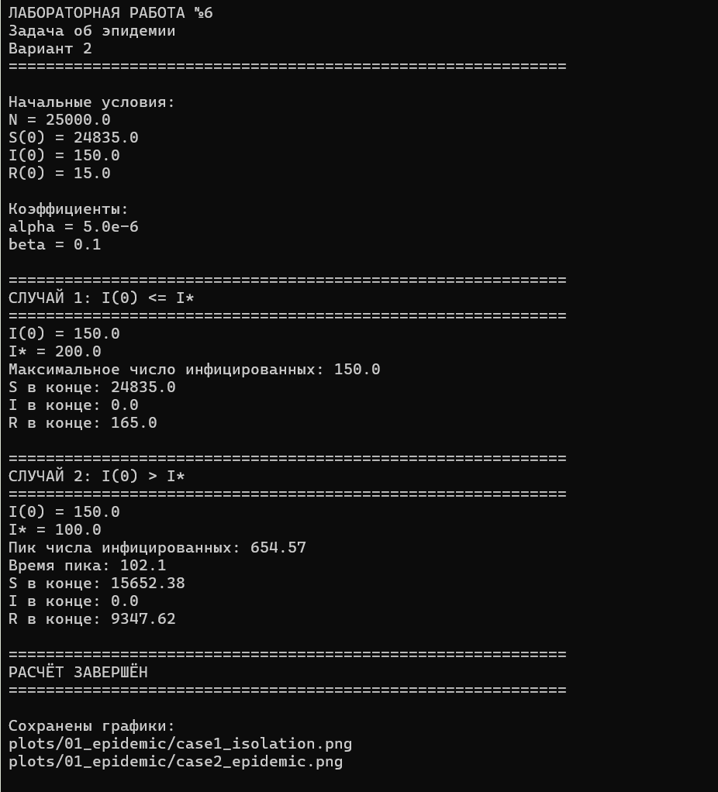
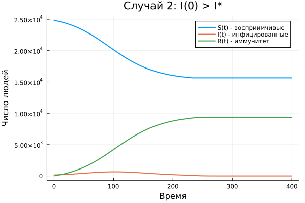
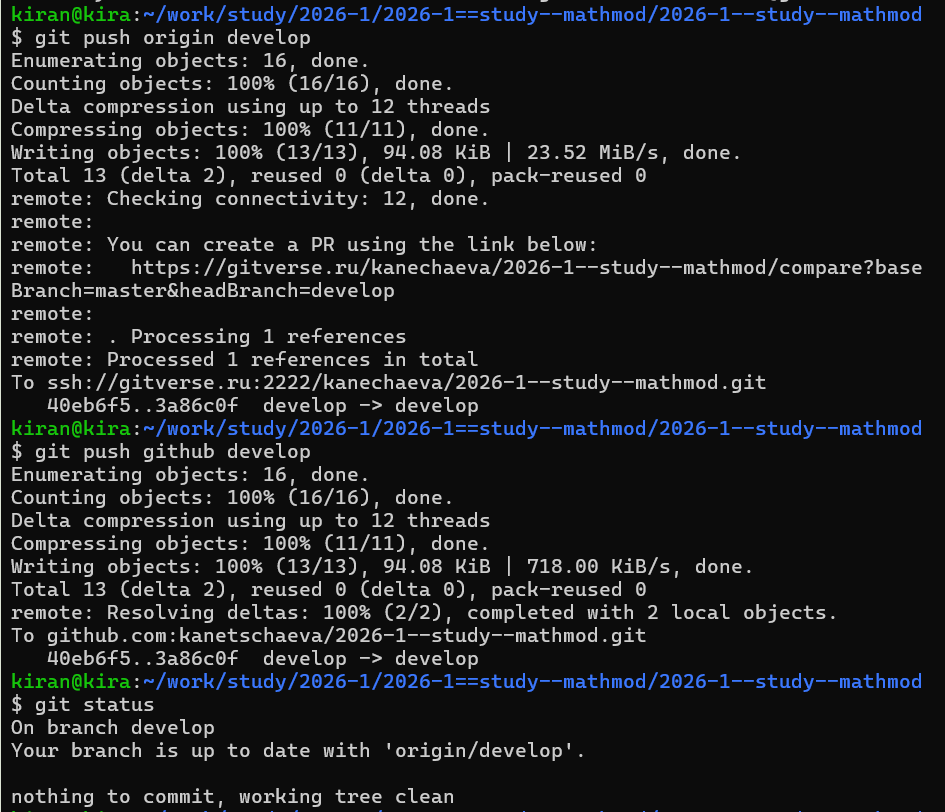

# Определение варианта

Номер варианта определялся по формуле

$$
(S_n \bmod N)+1.
$$

Для номера студенческого билета 1132236031 был получен вариант 2.

{width=90%}

# Постановка задачи

Рассматривается простейшая модель распространения эпидемии.

Популяция делится на три группы:

- $S(t)$ — восприимчивые к болезни, но пока здоровые;
- $I(t)$ — инфицированные и распространяющие инфекцию;
- $R(t)$ — здоровые люди с иммунитетом.

Для варианта 2:

$$
N=25000,
$$

$$
I(0)=150,
$$

$$
R(0)=15.
$$

Начальное число восприимчивых:

$$
S(0)=N-I(0)-R(0)=24835.
$$

Необходимо построить графики изменения числа людей во всех трёх группах и рассмотреть два случая:

1. $I(0)\le I^*$;
2. $I(0)>I^*$.

# Организация работы

Для лабораторной работы была создана отдельная структура каталогов для программы, графиков, отчёта и презентации.

{width=90%}

Для численного решения системы использовались пакеты SciMLBase и OrdinaryDiffEq, для построения графиков — Plots.

{width=90%}

# Математическая модель

Если количество инфицированных превышает критический уровень $I^*$, инфекция распространяется:

$$
\frac{dS}{dt}=-\alpha SI,
$$

$$
\frac{dI}{dt}=\alpha SI-\beta I,
$$

$$
\frac{dR}{dt}=\beta I.
$$

Если

$$
I(t)\le I^*,
$$

инфицированные считаются изолированными, поэтому новых заражений не возникает:

$$
\frac{dS}{dt}=0,
$$

$$
\frac{dI}{dt}=-\beta I,
$$

$$
\frac{dR}{dt}=\beta I.
$$

В численном эксперименте использовались коэффициенты

$$
\alpha=0.000005,
\qquad
\beta=0.1.
$$

Эти коэффициенты не заданы в индивидуальном варианте и были выбраны для проведения численного эксперимента.

# Программная реализация

В программе сначала задаются исходные данные варианта и автоматически вычисляется $S(0)$.

Оба режима модели реализованы внутри одной функции. На каждом шаге проверяется текущее значение $I(t)$ относительно критического уровня $I^*$.

{width=95%}

Если порог превышен, восприимчивые начинают заражаться. Если порог не превышен, число восприимчивых остаётся постоянным, инфицированные выздоравливают и переходят в группу $R$.

# Два сценария моделирования

Для выполнения задания были проведены два численных эксперимента при одинаковых начальных условиях.

Для первого случая выбран критический уровень

$$
I^*=200.
$$

Так как

$$
I(0)=150\le200,
$$

в начальный момент работает режим изоляции.

Для второго случая:

$$
I^*=100,
$$

поэтому

$$
I(0)=150>100,
$$

и инфекция начинает распространяться.

{width=95%}

Изменение критического уровня позволяет реализовать два условия, требуемые в задании, при одинаковых исходных данных варианта.

# Результаты выполнения программы

После запуска программа выводит результаты обоих экспериментов.

{width=92%}

# Первый случай: $I(0)\le I^*$

В первом случае новые заражения не возникают.

{width=90%}

Число восприимчивых практически не изменяется.

Число инфицированных постепенно уменьшается за счёт выздоровления, а число людей с иммунитетом увеличивается.

Эпидемическая вспышка в этом случае не развивается.

# Второй случай: $I(0)>I^*$

Во втором случае критический уровень в начальный момент превышен.

{width=90%}

В начале число инфицированных увеличивается, поскольку восприимчивые заражаются.

После достижения максимального значения число инфицированных начинает уменьшаться за счёт выздоровления.

При этом количество восприимчивых уменьшается, а группа $R$ увеличивается.

# Сравнение двух случаев

На следующем рисунке результаты представлены рядом.

{width=100%}

При одинаковых начальных условиях характер развития процесса определяется соотношением текущего числа инфицированных и критического уровня $I^*$.

Если порог не превышен, распространение блокируется.

Если порог превышен, возникает эпидемическая вспышка.

# Сохранение результатов

После завершения моделирования файлы лабораторной работы были добавлены в Git и отправлены в удалённые репозитории.

{width=90%}

# Вывод

В ходе лабораторной работы была реализована модель распространения эпидемии для второго варианта.

Популяция была разделена на группы $S$, $I$ и $R$.

Были рассмотрены два режима относительно критического уровня числа инфицированных.

При

$$
I(0)\le I^*
$$

новых заражений не возникает, а количество инфицированных постепенно уменьшается.

При

$$
I(0)>I^*
$$

инфекция сначала распространяется, число заболевших достигает максимума, после чего уменьшается за счёт выздоровления.

Таким образом, критический уровень $I^*$ определяет переход модели между режимом изоляции и распространением инфекции.
