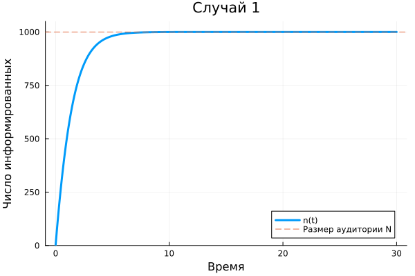
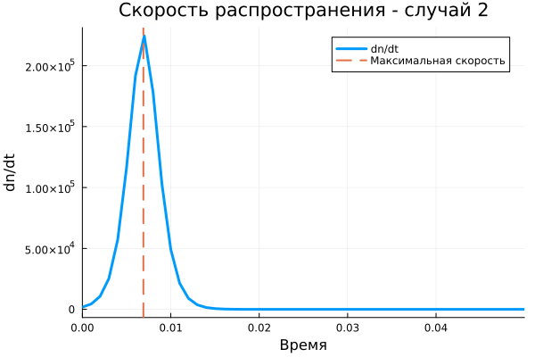
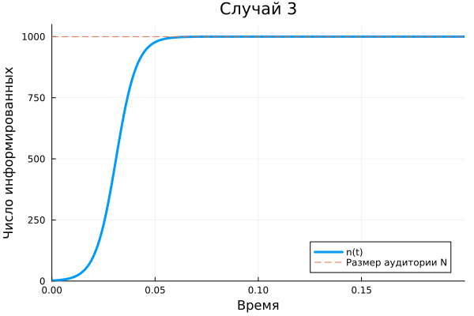
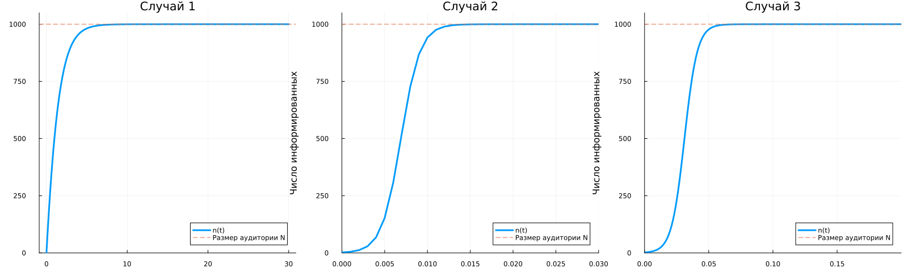

## Постановка задачи

**Вариант 2**

$$
N=1000,
\qquad
n(0)=2.
$$

$n(t)$ — число потенциальных покупателей, уже знающих о товаре.

Необходимо:

- исследовать три модели распространения рекламы;
- построить графики $n(t)$;
- для второго случая найти момент максимальной скорости распространения.

## Модель рекламы

Общий принцип:

$$
\frac{dn}{dt}
=
\left(\alpha_1(t)+\alpha_2(t)n\right)(N-n).
$$

**$\alpha_1$** — влияние рекламной кампании.

**$\alpha_2n$** — распространение информации между покупателями.

**$N-n$** — ещё не информированная часть аудитории.

## Случай 1

:::: {.columns align=center}

::: {.column width="38%"}

$$
\frac{dn}{dt}
=
(0.65+0.0002n)(N-n).
$$

По мере распространения рекламы

$$
n(t)\rightarrow N.
$$

Рост замедляется при насыщении аудитории.

:::

::: {.column width="62%"}

{width=100%}

:::

::::

## Случай 2

:::: {.columns align=center}

::: {.column width="38%"}

$$
\frac{dn}{dt}
=
(0.0003+0.9n)(N-n).
$$

Вклад распространения информации между покупателями здесь значительно сильнее.

Поэтому аудитория информируется очень быстро.

:::

::: {.column width="62%"}

{width=100%}

:::

::::

## Максимальная скорость

:::: {.columns align=center}

::: {.column width="38%"}

Для второго случая вычисляется

$$
\frac{dn}{dt}
$$

на плотной временной сетке.

Программа определяет:

- максимальную скорость;
- момент её достижения;
- число информированных клиентов в этот момент.

:::

::: {.column width="62%"}

{width=100%}

:::

::::

## Почему скорость имеет максимум

В начале информированных покупателей мало, поэтому распространение информации ещё ограничено.

Затем число информированных растёт, и усиливается передача информации между людьми.

После определённого момента остаётся всё меньше неинформированных покупателей:

$$
N-n(t)\rightarrow0.
$$

Поэтому скорость распространения снова уменьшается.

## Случай 3

:::: {.columns align=center}

::: {.column width="42%"}

Коэффициенты зависят от времени:

$$
\alpha_1(t)=0.1\sin(2t),
$$

$$
\alpha_2(t)=0.2\cos(3t).
$$

Поэтому интенсивность распространения рекламы меняется во времени.

:::

::: {.column width="58%"}

{width=100%}

:::

::::

## Сравнение моделей

{width=76%}

Все три модели имеют одну общую структуру, но различаются коэффициентами.

Это приводит к разной скорости и характеру распространения информации.

## Итог

Для варианта 2 исследованы три модели рекламной кампании.

Для каждой модели:

- выполнено численное решение;
- построена зависимость $n(t)$;
- исследовано насыщение аудитории.

Для второго случая дополнительно найден момент максимальной скорости распространения.

**Эффективность рекламы зависит от прямого рекламного воздействия, передачи информации между покупателями и оставшейся неинформированной аудитории.**
