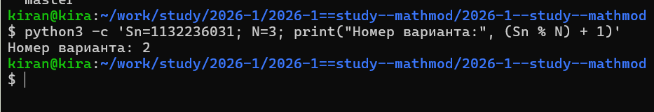
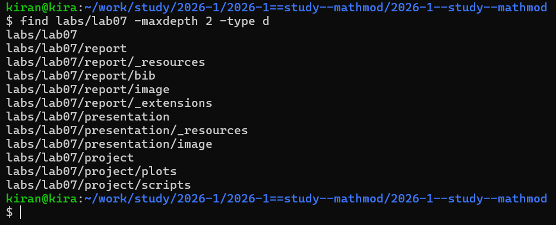
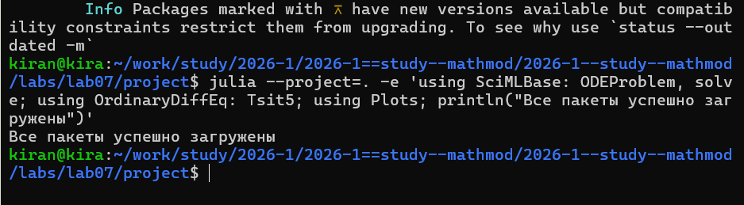
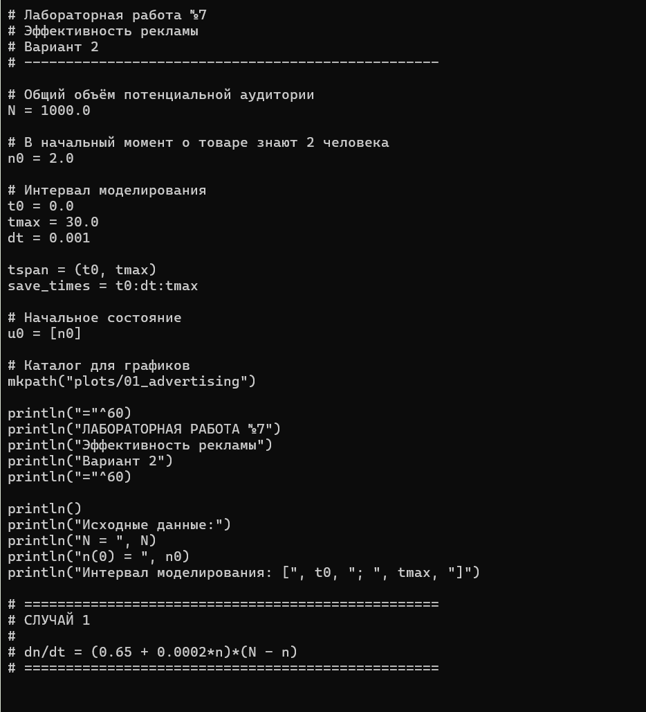
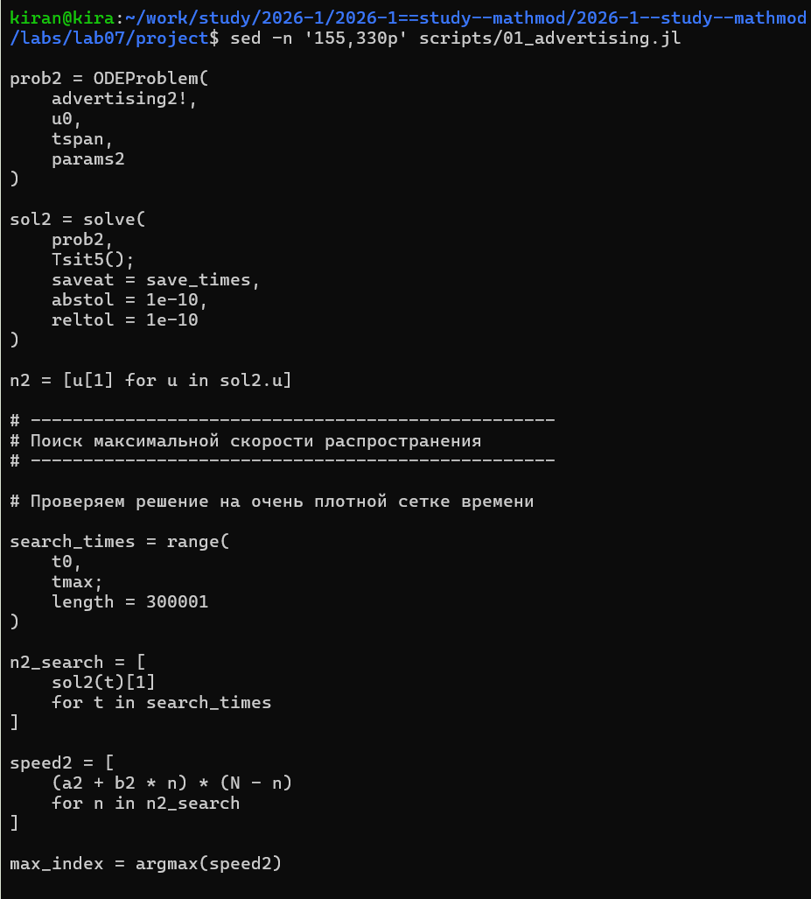
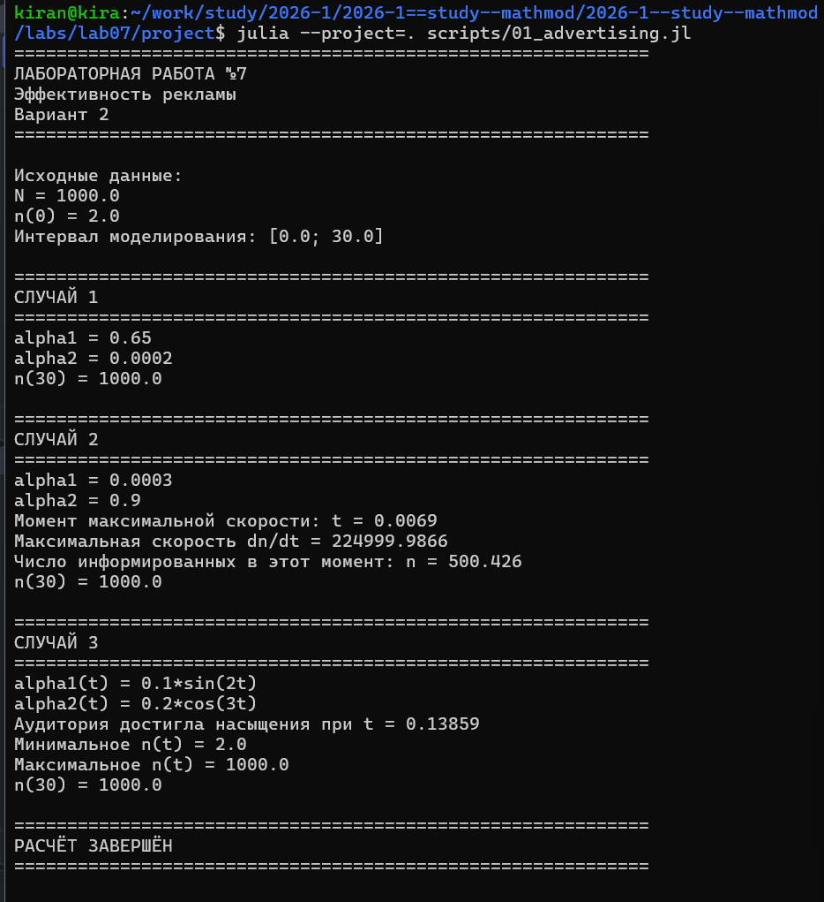
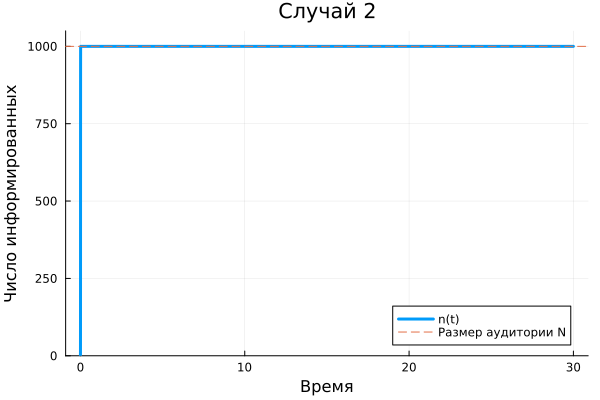
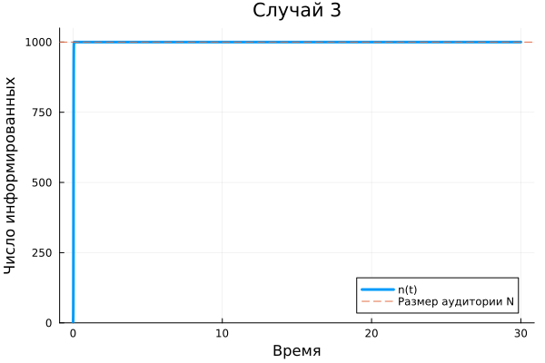
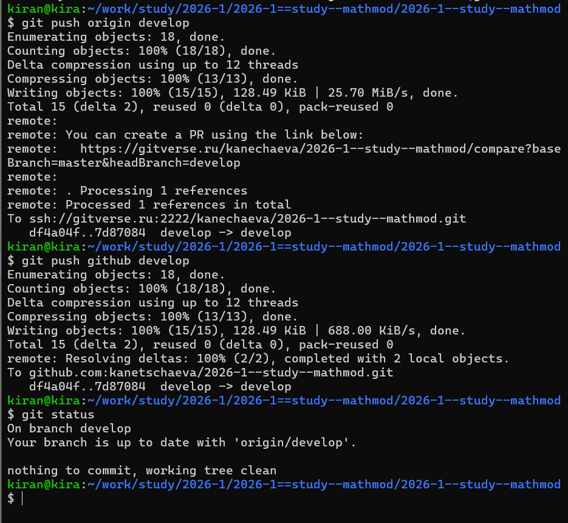

# Определение варианта

Номер варианта определялся по формуле

$$
(S_n \bmod N)+1.
$$

В индивидуальном задании рассматриваются три случая, поэтому при номере студенческого билета 1132236031 был получен вариант 2.

{width=90%}

# Постановка задачи

Рассматривается модель распространения информации о товаре среди потенциальных покупателей.

Пусть $n(t)$ — число людей, которые к моменту времени $t$ уже знают о товаре, а $N$ — общий размер потенциальной аудитории.

Для варианта 2:

$$
N=1000,
$$

$$
n(0)=2.
$$

Необходимо исследовать три модели распространения рекламы.

Первый случай:

$$
\frac{dn}{dt}
=
(0.65+0.0002n)(N-n).
$$

Второй случай:

$$
\frac{dn}{dt}
=
(0.0003+0.9n)(N-n).
$$

Для второго случая также необходимо определить момент, когда скорость распространения рекламы максимальна.

Третий случай:

$$
\frac{dn}{dt}
=
\left(0.1\sin(2t)+0.2\cos(3t)n\right)(N-n).
$$

# Смысл модели

В общем виде модель рекламной кампании включает два механизма распространения информации.

Первый механизм связан непосредственно с рекламной кампанией.

Второй зависит от числа уже информированных покупателей и описывает распространение информации между потенциальными клиентами.

Множитель

$$
N-n(t)
$$

показывает число людей, которые ещё не знают о товаре.

Поэтому по мере приближения $n(t)$ к $N$ дальнейшее распространение рекламы замедляется.

# Организация работы

Для лабораторной работы была создана отдельная структура каталогов для программы, графиков, отчёта и презентации.

{width=90%}

Для численного решения дифференциальных уравнений использовались SciMLBase и OrdinaryDiffEq, а для построения графиков — пакет Plots.

{width=90%}

# Программная реализация

Исходные параметры варианта и первые две модели задаются непосредственно в программе.

{width=95%}

Для каждого случая создаётся отдельная задача Коши и выполняется численное решение.

В численном эксперименте используется временной интервал от 0 до 30, аналогично программному примеру методических материалов.

# Максимальная скорость распространения

Для второго случая дополнительно определяется момент максимальной скорости распространения рекламы.

После численного решения программа вычисляет

$$
\frac{dn}{dt}
$$

на плотной временной сетке.

Затем с помощью поиска максимального значения определяется момент времени, в который скорость распространения информации наибольшая.

Для третьего случая коэффициенты уже зависят от времени:

$$
\alpha_1(t)=0.1\sin(2t),
$$

$$
\alpha_2(t)=0.2\cos(3t).
$$

{width=95%}

# Результаты выполнения программы

После запуска программа последовательно решает все три модели и отдельно определяет максимальную скорость распространения для второго случая.

{width=92%}

# Первый случай

В первом случае используется модель

$$
\frac{dn}{dt}
=
(0.65+0.0002n)(N-n).
$$

{width=86%}

Количество информированных покупателей увеличивается и постепенно приближается к размеру всей потенциальной аудитории.

По мере насыщения аудитории скорость дальнейшего роста уменьшается.

# Второй случай

Для второго случая:

$$
\frac{dn}{dt}
=
(0.0003+0.9n)(N-n).
$$

{width=86%}

В этой модели вклад, зависящий от числа уже информированных покупателей, значительно сильнее, поэтому распространение информации происходит очень быстро.

# Скорость распространения во втором случае

{width=86%}

Скорость сначала увеличивается, достигает максимального значения, а затем уменьшается.

В начале рост ускоряется благодаря увеличению числа уже информированных людей.

После достижения максимума всё меньше потенциальных покупателей остаются неинформированными, поэтому скорость распространения снижается.

# Третий случай

Для третьей модели коэффициенты распространения рекламы меняются со временем:

$$
\frac{dn}{dt}
=
\left(0.1\sin(2t)+0.2\cos(3t)n\right)(N-n).
$$

{width=86%}

Из-за зависимости коэффициентов от времени характер изменения числа информированных покупателей отличается от первых двух случаев.

# Сравнение моделей

На следующем рисунке представлены результаты всех трёх моделей.

{width=100%}

Различия между решениями связаны с различными коэффициентами, определяющими интенсивность рекламной кампании и распространение информации между покупателями.

# Сохранение результатов

После завершения лабораторной работы файлы были добавлены в Git и отправлены в удалённые репозитории.

{width=90%}

# Вывод

В ходе лабораторной работы были исследованы три модели распространения рекламы для второго варианта.

Для каждой модели было выполнено численное решение и построен график изменения числа информированных потенциальных покупателей.

Во втором случае дополнительно была исследована скорость распространения рекламы и найден момент её максимального значения.

Полученные результаты показывают, что динамика рекламной кампании зависит как от прямого рекламного воздействия, так и от распространения информации между уже информированными покупателями.

При приближении числа информированных покупателей к общей численности аудитории дальнейший рост замедляется из-за насыщения рынка.
