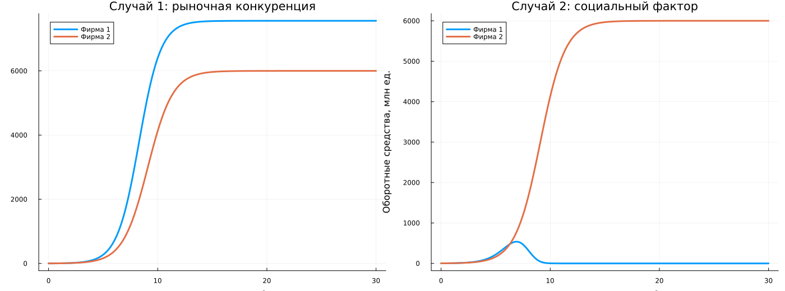

## Постановка задачи

**Вариант 2**

Начальные оборотные средства:

$$
M_1(0)=1.9,
\qquad
M_2(0)=2.1.
$$

Необходимо сравнить:

1. чисто рыночную конкуренцию;
2. конкуренцию с дополнительным социально-психологическим фактором.

## Исходные параметры

:::: {.columns}

::: {.column width="50%"}

$$
p_{cr}=25,
\qquad
N=50,
\qquad
q=1
$$

$$
\tau_1=30,
\qquad
\tau_2=20
$$

:::

::: {.column width="50%"}

$$
p_1=7,
\qquad
p_2=10
$$

$M_1$, $M_2$ — оборотные средства фирм.

Используется безразмерное время

$$
\theta=\frac{t}{c_1}.
$$

:::

::::

## Коэффициенты модели

Коэффициенты рассчитываются программно из исходных параметров:

$$
a_1\approx1.13\cdot10^{-5},
\qquad
a_2=1.25\cdot10^{-5},
$$

$$
b\approx2.83\cdot10^{-10},
$$

$$
c_1\approx0.0857,
\qquad
c_2=0.075.
$$

Ручная подстановка коэффициентов не требуется.

## Случай 1: рыночная конкуренция

Для первой фирмы:

$$
\frac{dM_1}{d\theta}
=
M_1-\frac{b}{c_1}M_1M_2-\frac{a_1}{c_1}M_1^2.
$$

Для второй фирмы:

$$
\frac{dM_2}{d\theta}
=
\frac{c_2}{c_1}M_2
-\frac{b}{c_1}M_1M_2
-\frac{a_2}{c_1}M_2^2.
$$

## Результат первого случая

:::: {.columns align=center}

::: {.column width="35%"}

К концу интервала:

$$
M_1\approx7559.85,
$$

$$
M_2\approx5999.83.
$$

Обе фирмы сохраняются на рынке.

:::

::: {.column width="65%"}

{width=100%}

:::

::::

## Случай 2: дополнительный фактор

В первом уравнении коэффициент взаимодействия изменяется:

$$
\frac{b}{c_1}
\quad\longrightarrow\quad
\frac{b}{c_1}+0.0012.
$$

Начальные экономические параметры остаются теми же.

Учитывается формирование предпочтения потребителей в пользу одного товара.

## Результат второго случая

:::: {.columns align=center}

::: {.column width="35%"}

Фирма 1 достигает максимума:

$$
M_1\approx536.93
$$

при

$$
\theta\approx6.91.
$$

Затем

$$
M_1\rightarrow0.
$$

Фирма 2 выходит примерно на 6000.

:::

::: {.column width="65%"}

{width=100%}

:::

::::

## Что изменилось

**Случай 1**

Обе фирмы растут и занимают свои части рынка.

**Случай 2**

Дополнительное влияние делает конкуренцию несимметричной.

Первая фирма после первоначального роста начинает терять оборотные средства.

Вторая фирма сохраняет устойчивое положение.

## Сравнение

{width=78%}

Экономические исходные параметры одинаковы.

Главное отличие двух моделей — дополнительный коэффициент взаимодействия во втором случае.

## Итог

Для варианта 2 реализованы две модели конкуренции фирм.

- при рыночной конкуренции обе фирмы сохраняются;
- при дополнительном социально-психологическом воздействии первая фирма практически вытесняется с рынка.

**Характер взаимодействия конкурентов существенно влияет на долгосрочную динамику оборотных средств.**
