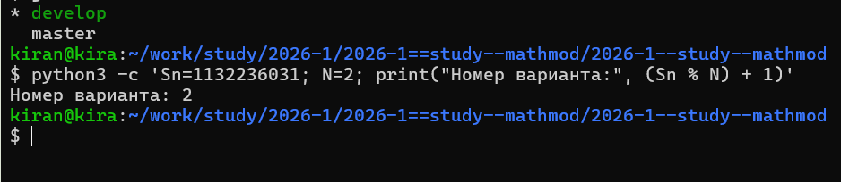
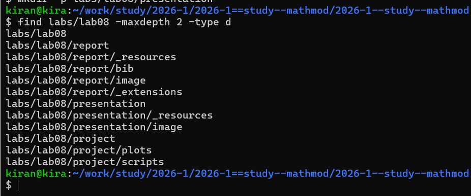
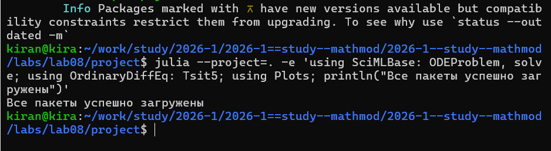
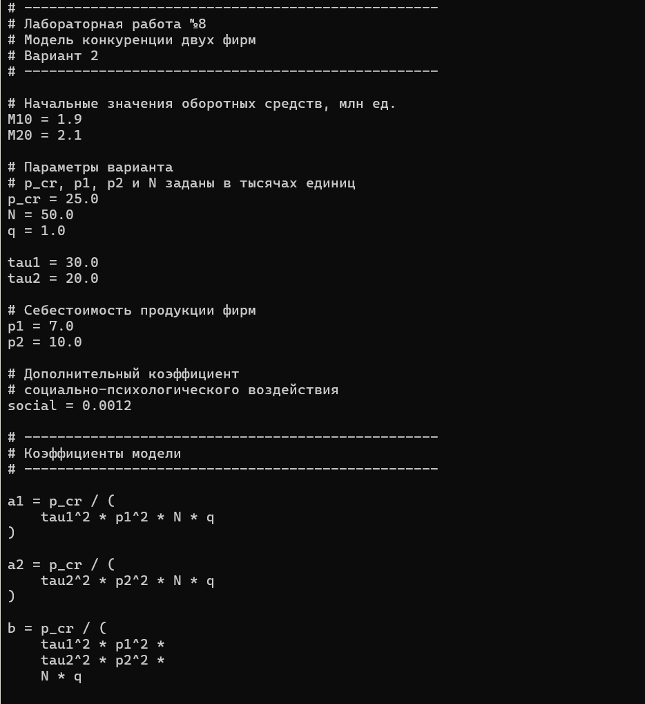
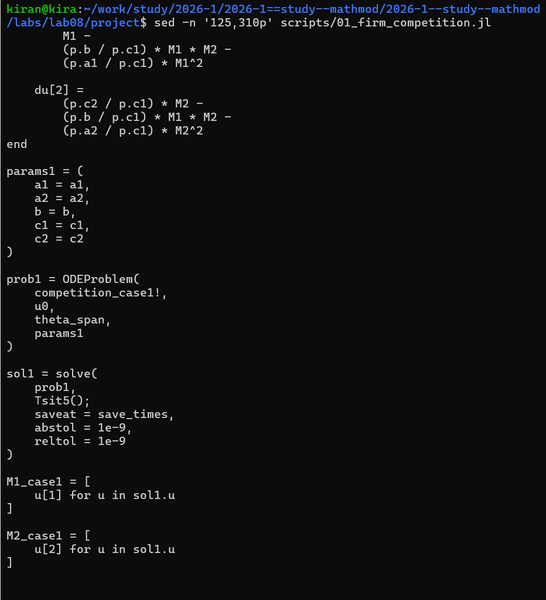
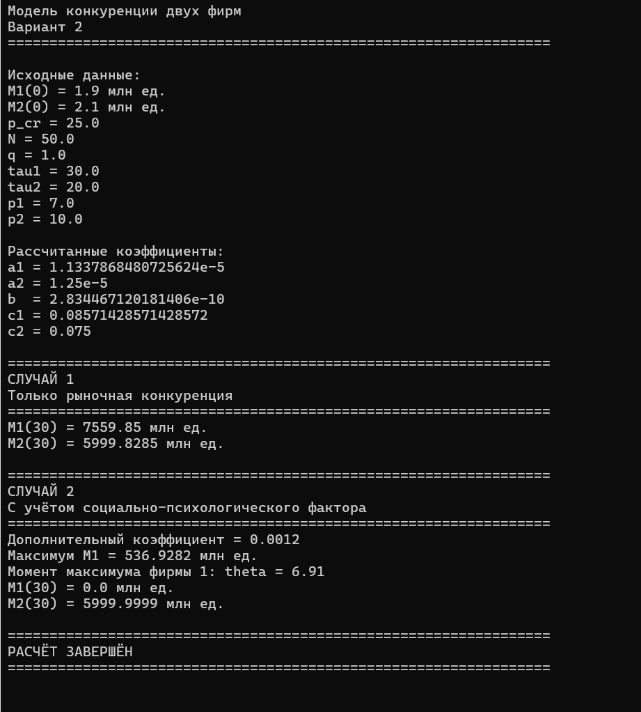
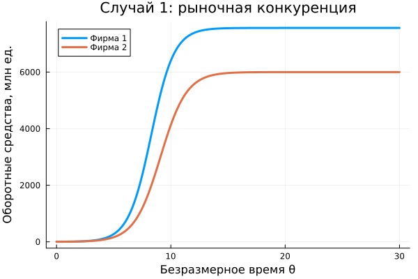
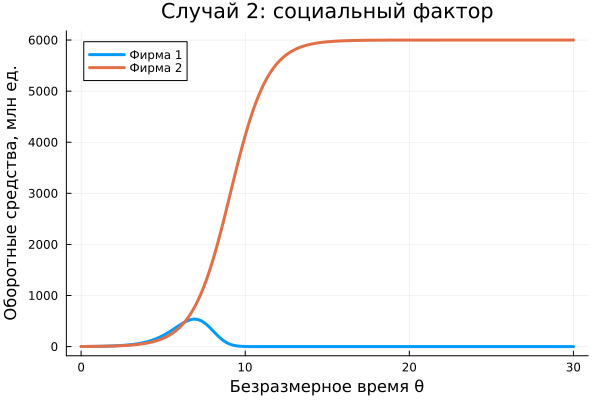
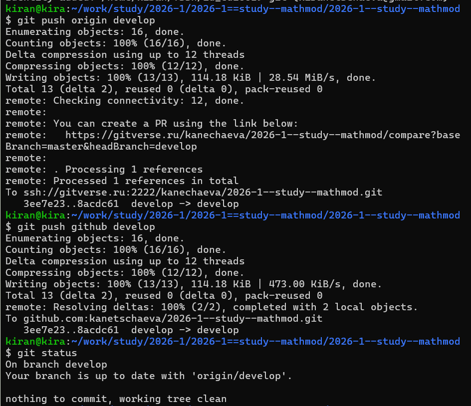

# Определение варианта

Номер варианта определялся по формуле

$$
(S_n \bmod N)+1.
$$

В индивидуальном задании рассматриваются два случая, поэтому

$$
N=2.
$$

Для номера студенческого билета 1132236031 был получен вариант 2.

{width=90%}

# Постановка задачи

Рассматривается модель конкуренции двух фирм, выпускающих взаимозаменяемые товары и работающих в одной рыночной нише.

Для варианта 2 заданы начальные оборотные средства

$$
M_1(0)=1.9,
\qquad
M_2(0)=2.1
$$

млн единиц.

Также заданы параметры:

$$
p_{cr}=25,
\qquad
N=50,
\qquad
q=1,
$$

$$
\tau_1=30,
\qquad
\tau_2=20,
$$

$$
p_1=7,
\qquad
p_2=10.
$$

Необходимо построить динамику оборотных средств обеих фирм для двух случаев:

1. конкуренция только рыночными методами;
2. конкуренция с дополнительным социально-психологическим фактором.

# Организация работы

Для лабораторной работы была создана отдельная структура каталогов для программы, графиков, отчёта и презентации.

{width=90%}

Для численного решения системы дифференциальных уравнений использовались пакеты SciMLBase и OrdinaryDiffEq, а для построения графиков — Plots.

{width=90%}

# Параметры модели

Коэффициенты системы вычисляются программно из исходных параметров варианта:

$$
a_1=
\frac{p_{cr}}
{\tau_1^2p_1^2Nq},
$$

$$
a_2=
\frac{p_{cr}}
{\tau_2^2p_2^2Nq},
$$

$$
b=
\frac{p_{cr}}
{\tau_1^2p_1^2\tau_2^2p_2^2Nq},
$$

$$
c_1=
\frac{p_{cr}-p_1}{\tau_1p_1},
\qquad
c_2=
\frac{p_{cr}-p_2}{\tau_2p_2}.
$$

Для варианта 2 программа получает приблизительно:

$$
a_1=1.1338\cdot10^{-5},
$$

$$
a_2=1.25\cdot10^{-5},
$$

$$
b=2.8345\cdot10^{-10},
$$

$$
c_1=0.085714,
\qquad
c_2=0.075.
$$

{width=95%}

Таким образом, коэффициенты системы не вычислялись отдельно вручную, а формировались непосредственно в программе из данных варианта.

# Первый случай

В первом случае конкурентная борьба ведётся только рыночными методами.

Используется система

$$
\frac{dM_1}{d\theta}
=
M_1
-
\frac{b}{c_1}M_1M_2
-
\frac{a_1}{c_1}M_1^2,
$$

$$
\frac{dM_2}{d\theta}
=
\frac{c_2}{c_1}M_2
-
\frac{b}{c_1}M_1M_2
-
\frac{a_2}{c_1}M_2^2.
$$

Здесь используется безразмерное время

$$
\theta=\frac{t}{c_1}.
$$

# Второй случай

Во втором случае дополнительно учитывается социально-психологический фактор, связанный с формированием предпочтения потребителей.

В первом уравнении коэффициент взаимодействия становится равным

$$
\frac{b}{c_1}+0.0012.
$$

Остальные исходные данные остаются такими же, что позволяет сравнить влияние именно дополнительного фактора.

{width=95%}

# Результаты выполнения программы

Обе системы были численно решены на интервале

$$
0\le\theta\le30.
$$

{width=92%}

Для первого случая к концу интервала получены значения приблизительно

$$
M_1(30)\approx7559.85,
$$

$$
M_2(30)\approx5999.83.
$$

Во втором случае первая фирма достигает максимума примерно

$$
M_1\approx536.93
$$

при

$$
\theta\approx6.91,
$$

после чего её оборотные средства уменьшаются практически до нуля.

Оборотные средства второй фирмы при этом приближаются к

$$
M_2\approx6000.
$$

# Результат первого случая

{width=88%}

В первом случае оборотные средства обеих фирм растут.

После переходного процесса значения постепенно стабилизируются.

Таким образом, при заданных параметрах обе фирмы сохраняются на рынке и достигают собственных устойчивых уровней оборотных средств.

# Результат второго случая

{width=88%}

Во втором случае динамика первой фирмы существенно изменяется.

Сначала её оборотные средства увеличиваются, достигают максимального значения, а затем начинают снижаться.

К концу рассматриваемого интервала значение $M_1$ становится практически нулевым.

Вторая фирма продолжает расти и выходит на устойчивый уровень около 6000 млн единиц.

# Сравнение двух случаев

{width=100%}

Начальные экономические параметры в двух экспериментах одинаковы.

Различие заключается в наличии дополнительного социально-психологического фактора во втором случае.

При чисто рыночной конкуренции обе фирмы сохраняются на рынке.

После изменения коэффициента взаимодействия положение первой фирмы ухудшается настолько, что её оборотные средства практически исчезают.

Это показывает высокую чувствительность результата модели к характеру взаимодействия конкурентов.

# Сохранение результатов

После завершения расчётов файлы лабораторной работы были добавлены в Git и отправлены в удалённые репозитории.

{width=90%}

# Вывод

В ходе лабораторной работы была реализована модель конкуренции двух фирм для варианта 2.

Коэффициенты системы были рассчитаны программно по заданным экономическим параметрам.

Были рассмотрены два сценария.

В первом случае учитывалась только рыночная конкуренция. Обе фирмы увеличили оборотные средства и сохранились на рынке.

Во втором случае был дополнительно учтён социально-психологический фактор. Это привело к тому, что первая фирма после первоначального роста начала терять оборотные средства и практически была вытеснена с рынка, тогда как вторая фирма сохранила устойчивое положение.

Таким образом, изменение характера взаимодействия фирм может существенно менять долгосрочную динамику системы.
